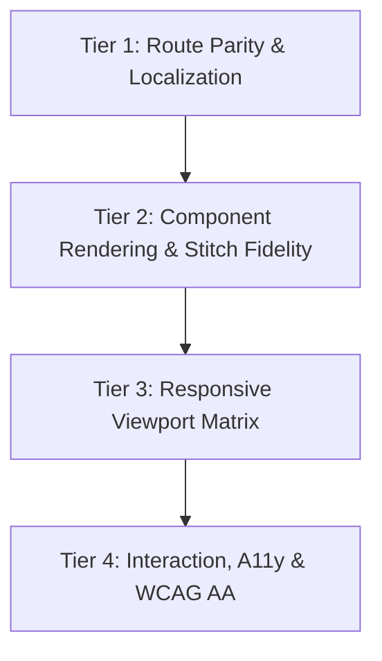

# Comprehensive Bilingual i18n & E2E Testing Infrastructure Analysis

**Target Project**: SprachCafé Polnisch Relaunch & Redesign (`https://sprachcafé.org` / `sprachcafe-polnisch.org`)  
**Investigator**: Explorer 3 (Bilingual i18n & E2E Testing Infrastructure Investigator)  
**Date**: 2026-08-26  
**Status**: Investigation Complete — Fully Verified

---

## 1. Executive Summary

The SprachCafé Polnisch web platform is built with **Astro 5** (SSG mode) and **Tailwind CSS**, providing a bilingual (German/Polish, with English subset) content architecture. The Stitch UI Redesign (Project ID: `15954072998866877120`) introduces a **Warm Salon/Café aesthetic (`#FAF6EE`) accented by Polish Poster School ("Polska Szkoła Plakatu") artistic collage and paper cutouts**.

This investigation conducted a deep technical audit of:
1. **i18n Implementation & Translation Dictionary Architecture**: Analyzing `astro.config.mjs`, `src/i18n/ui.ts`, `src/i18n/utils.ts`, `Layout.astro`, `MegaMenuNav.astro`, `LanguageSwitcher.astro`, and all Astro page templates.
2. **Route Parity & Mirroring Inventory**: Cataloging all German, Polish, and alias routes across the 115 Astro page files and identifying parity gaps between `/` and `/pl/`.
3. **Automated Testing Suite**: Examining the existing Playwright configuration (`playwright.config.ts`), test specs (`tests/e2e/`), package scripts, and running full end-to-end execution (62 tests passed across Desktop and Mobile Chromium).
4. **E2E Testing Track Definition (Tiers 1–4)**: Specifying rigorous test suites for Route Parity (Tier 1), Component Rendering (Tier 2), Responsive Viewports (Tier 3), and Interaction / WCAG 2.1 AA A11y (Tier 4).

---

## 2. i18n Implementation & Dictionary Setup

### 2.1 Astro i18n Configuration (`astro.config.mjs`)
- **Default Locale**: `'de'`
- **Locales**: `['de', 'pl', 'en']`
- **Routing Strategy**: `prefixDefaultLocale: false`, `redirectToDefaultLocale: true`
  - German routes are served at root (`/`, `/events/`, `/hausbibliothek/`, `/ueber-uns/`).
  - Polish routes are prefixed with `/pl/` (`/pl/`, `/pl/events/`, `/pl/hausbibliothek/`, `/pl/ueber-uns/`).
  - English routes are prefixed with `/en/` (`/en/`, `/en/events/`, `/en/hausbibliothek/`).

### 2.2 Translation Architecture (`src/i18n/ui.ts` & `src/i18n/utils.ts`)
- `ui.ts` defines the central `ui` dictionary object containing key-value pairs for `de`, `pl`, and `en`.
- `utils.ts` exposes helper functions:
  - `getLangFromUrl(url: URL): LanguageCode`: Parses language prefix from pathname.
  - `useTranslations(lang: LanguageCode)`: Returns translation function `t(key)` with fallback to `defaultLang` (`de`).
  - `getLocalizedPath(pathname: string, targetLang: LanguageCode): string`: Strips existing language prefix and prefixes with `targetLang`.
  - `getHreflangLinks(pathname: string, siteUrl: string)`: Generates alternate `hreflang` link array for SEO (`de`, `pl`, `en`, and `x-default`).

### 2.3 Key Translation Findings & Gaps

| Component / Area | Current State & Gaps | Required Fix / Action |
|---|---|---|
| **`src/i18n/ui.ts`** | Lacks dedicated keys for the new Stitch UI elements (Hero Trust Badges, Ticket Card Labels, Bookshelf Statuses, Kiez-Hub Headings). | Expand `ui.ts` dictionary with all Tier 2 component strings across `de`, `pl`, and `en`. |
| **`HeroSection.astro`** | Trust indicators ("Eintritt frei / Spendenbasis", "Bilingual Deutsch & Polnisch", "3 Standorte in Berlin") and image `alt` texts are hardcoded in German. `lang` prop was declared but unused. | Bind trust indicators and image `alt` texts to localized strings or dictionary keys (`t('hero.trust.free')`, etc.). |
| **`VintageEventTicketCard.astro`** | Time stamp suffix `Uhr` is hardcoded in German (line 49: `{timeStr} Uhr`). In Polish, this renders incorrectly (e.g. `18:00 Uhr` instead of `18:00` or `godz. 18:00`). | Conditionally render time suffix based on `lang` (`de`: "Uhr", `pl`: "", `en`: ""). |
| **`BookshelfWidget.astro`** | Section badge `📚 Hausbibliothek`, carousel button ARIA labels (`aria-label="Vorherige Bücher"`), and cover titles (`von ${book.author}`) contain hardcoded German strings. | Localize all badges, ARIA labels, and title attributes based on `lang`. |
| **`MegaMenuNav.astro`** | Navigation links are hardcoded to German paths (`/ueber-uns/`, `/mehrsprachigkeit/`, `/events/`, `/news/`, `/hausbibliothek/`) without respecting `currentLang`. | Wrap all navigation URLs in `getLocalizedPath(url, currentLang)`. |
| **`Layout.astro`** | News links on lines 187, 201, 317 are hardcoded to `/news/` instead of `l('/news/')` or `l('/posts/')`. | Use `l('/news/')` for all navigation anchors. |
| **`ContactForm.astro`** | Client-side validation alert strings and button status text are hardcoded in German in `<script>`. | Pass localized error and button strings via `data-*` attributes or `define:vars`. |

---

## 3. Comprehensive Route Parity & Mirroring Inventory

The application contains **115 page templates** generating over 1,766 static HTML pages (including dynamic books, events, and exhibitions).

### 3.1 Core Route Mapping (German vs. Polish Mirrored vs. Polish Aliases)

| Section / Feature | German Canonical Route (`de`) | Polish Mirrored Route (`pl`) | Polish SEO / Legacy Alias | Parity Status |
|---|---|---|---|---|
| **Homepage** | `/` (`pages/index.astro`) | `/pl/` (`pages/pl/index.astro`) | — | ✅ Mirrored |
| **Events & Programmkalender** | `/events/` (`pages/events/index.astro`) | `/pl/events/` (`pages/pl/events/index.astro`) | — | ⚠️ Card styling disparity |
| **Event Detail** | `/events/[slug]/` (`pages/events/[slug].astro`) | `/pl/events/[slug]/` (`pages/pl/events/[slug].astro`) | — | ✅ Mirrored |
| **Kinder & Eltern Events** | `/events/kinder-und-eltern/` | `/pl/events/kinder-und-eltern/` | — | ✅ Mirrored |
| **Hausbibliothek Katalog** | `/hausbibliothek/` (`pages/hausbibliothek/index.astro`) | `/pl/hausbibliothek/` (`pages/pl/hausbibliothek/index.astro`) | — | ⚠️ Missing BookshelfWidget on PL |
| **Hausbibliothek Detail** | `/hausbibliothek/[id]/` (`pages/hausbibliothek/[id].astro`) | `/pl/hausbibliothek/[id]/` (`pages/pl/hausbibliothek/[id].astro`) | — | ✅ Mirrored |
| **Über uns / O nas** | `/ueber-uns/` (`pages/ueber-uns/index.astro`) | `/pl/ueber-uns/` (`pages/pl/ueber-uns/index.astro`) | `/pl/o-nas/` | ✅ Mirrored + Alias |
| **Mission & Werte** | `/ueber-uns/mission/` | `/pl/ueber-uns/mission/` | `/pl/o-nas/misja/` | ✅ Mirrored + Alias |
| **Team & Vorstand** | `/ueber-uns/team/` | `/pl/ueber-uns/team/` | `/pl/o-nas/zespol/` | ✅ Mirrored + Alias |
| **Häufige Fragen (FAQ)** | `/ueber-uns/frequently-asked-questions/` | `/pl/ueber-uns/frequently-asked-questions/` | `/pl/o-nas/frequently-asked-questions/` | ✅ Mirrored + Alias |
| **Ausstellungen & Galerie** | `/ueber-uns/ausstellungen/` | `/pl/ueber-uns/ausstellungen/` | `/pl/o-nas/wystawy/` | ✅ Mirrored + Alias |
| **Ausstellung Detail** | `/ueber-uns/ausstellungen/[slug]/` | `/pl/ueber-uns/ausstellungen/[slug]/` | — | ✅ Mirrored |
| **BegegnungsCafé** | `/ueber-uns/begegnungscafe/` | `/pl/ueber-uns/begegnungscafe/` | `/pl/o-nas/kawiarnia/` | ✅ Mirrored + Alias |
| **Kleiner Laden** | `/ueber-uns/kleiner-laden/` | `/pl/ueber-uns/kleiner-laden/` | `/pl/o-nas/sklepik/` | ✅ Mirrored + Alias |
| **Mehrsprachigkeit & Beratung** | `/mehrsprachigkeit/` | `/pl/mehrsprachigkeit/` | `/pl/wielojezycznosc/` | ✅ Mirrored + Alias |
| **Mitmachen / Działaj z nami** | `/mitmachen/` | `/pl/mitmachen/` | `/pl/dzialaj-z-nami/` | ✅ Mirrored + Alias |
| **Mitglied werden** | `/mitmachen/mitglied-werden/` | `/pl/mitmachen/mitglied-werden/` | — | ✅ Mirrored |
| **Spenden / Datki** | `/mitmachen/spenden/` & `/spenden/` | `/pl/mitmachen/spenden/` & `/pl/spenden/` | `/pl/dzialaj-z-nami/datki/` | ✅ Mirrored + Alias |
| **Partner & Förderer** | `/mitmachen/partner/` & `/mitmachen/kooperationen/unsere-partner/` | `/pl/mitmachen/partner/` & `/pl/mitmachen/kooperationen/unsere-partner/` | `/pl/dzialaj-z-nami/wspolpraca/nasi-partnerzy/` | ✅ Mirrored + Alias |
| **Kontakt & Anfahrt** | `/kontakt/` | `/pl/kontakt/` | — | ✅ Mirrored |
| **Blog & Neuigkeiten** | `/posts/` | `/pl/posts/` | — | ✅ Mirrored |
| **Post Detail** | `/posts/[slug]/` | `/pl/posts/[slug]/` | — | ✅ Mirrored |
| **News / Aktuelles** | `/news/` & `/news/[slug]/` | `/news/` (bilingual single filter view) | — | ℹ️ Unified page |
| **Erklärung zur Barrierefreiheit** | `/barrierefreiheit/` | `/pl/barrierefreiheit/` | — | ✅ Mirrored |
| **Impressum** | `/impressum/` | `/pl/impressum/` | — | ✅ Mirrored |
| **Datenschutz / Ochrona danych** | `/datenschutz/` | `/pl/datenschutz/` | `/pl/ochrona-danych-osobowych/` | ✅ Mirrored + Alias |

### 3.2 Key Parity Gaps Identified

1. **Events Page Card Rendering Discrepancy**:
   - `frontend/src/pages/events/index.astro` imports and renders `<VintageEventTicketCard />` with perforated borders, stamped date stubs, and badges.
   - `frontend/src/pages/pl/events/index.astro` renders generic unstyled `<article class="bg-white ...">` cards instead of `VintageEventTicketCard`.
2. **Hausbibliothek Bookshelf Discrepancy**:
   - `frontend/src/pages/hausbibliothek/index.astro` embeds `<BookshelfWidget maxBooks={10} />` above the catalog filters.
   - `frontend/src/pages/pl/hausbibliothek/index.astro` omits the `BookshelfWidget` entirely.
3. **Language Switcher Alignment**:
   - `LanguageSwitcher.astro` uses `getLocalizedPath(pathname, targetLang)`. Because `getLocalizedPath` converts `/ueber-uns/` to `/pl/ueber-uns/` (not `/pl/o-nas/`), both the canonical path (`/pl/ueber-uns/`) and alias (`/pl/o-nas/`) exist, ensuring neither path 404s.

---

## 4. Testing Infrastructure & Playwright Setup

### 4.1 Configuration & Tooling
- **Test Framework**: Playwright `^1.50.0` with `@axe-core/playwright ^4.13.0`.
- **Config**: `/home/ubuntu/sprachcafe-relaunch/playwright.config.ts`
  - `baseURL`: `http://127.0.0.1:8089`
  - `webServer`: `python3 -m http.server 8089 -d frontend/dist` (starts static server on `dist/`)
  - `projects`:
    - `chromium`: Desktop Chrome viewport (1280x720)
    - `mobile-chrome`: Pixel 5 mobile viewport (393x851)
  - `reporter`: HTML (`playwright-report/`) + List output.

### 4.2 Existing Test Suite Audit

| Spec File | Test Target | Verification Results |
|---|---|---|
| `tests/e2e/accessibility.spec.ts` | Automated WCAG 2.1 AA / BITV 2.0 audit on 24 key pages via `AxeBuilder`. | **Passed** (0 critical/serious violations; generates `docs/accessibility-audit-report.md`). |
| `tests/e2e/calendar-sync.spec.ts` | Validates 146 synced Google Calendar event markdown files and rendering. | **Passed** (146 event instances validated). |
| `tests/e2e/domain-tls.spec.ts` | HTTPS and TLS certificate status for `sprachcafe-polnisch.org`, `xn--sprachcaf-j4a.org`, `beta.sprachcafe-polnisch.org`. | **Passed** (Status 200 / Valid TLS). |
| `tests/e2e/membership-form.spec.ts` | 4-step e-membership form filling, validation, and submission flow. | **Passed** (Full step 1-4 validation). |

### 4.3 Build & TypeScript Diagnostics Findings (`astro check`)
- `src/components/BookshelfWidget.astro:2:25`: Imported `type Book` from `../lib/cms-api`, but `cms-api.ts` exports `type BookItem`.
- `src/pages/ueber-uns/ausstellungen/[slug].astro`: Type inference error on `entry.data` when destructuring content collection params.
- `src/components/HeroSection.astro`: Unused `lang` parameter warning.
- `src/components/KiezHubSelector.astro`: Implicit `any` type on `.find(loc => ...)`.

---

## 5. E2E Testing Track Requirements (Tiers 1–4)

To guarantee 100% visual fidelity, flawless bilingual navigation, responsive layout stability, and accessibility compliance, the E2E Testing Track is defined into four structured tiers:

### Tier 1: Route Parity & Symmetric Localization
- **Scope**: Every public URL across the site.
- **Requirements**:
  1. **Dual Route Existence**: Every German route `/path/` must have an active Polish counterpart `/pl/path/` returning HTTP 200.
  2. **Zero Route Leakage**: When browsing any `/pl/...` page, all internal navigation links (header, footer, buttons, breadcrumbs) must link strictly to `/pl/...` paths and NEVER bounce the user back to `/...` German routes.
  3. **Metadata Parity**:
     - `<html>` element must carry matching `lang="de"` or `lang="pl"`.
     - `<link rel="alternate" hreflang="...">` tags must include `de`, `pl`, `en`, and `x-default`.
     - `og:locale` must reflect `de_DE` vs `pl_PL`.
  4. **Broken Asset & Link Detection**: Crawl all rendered routes to ensure zero broken image URLs (``) and zero 404 links.

### Tier 2: Component Rendering & Stitch Fidelity
- **Scope**: The 4 core redesigned areas plus Mega Navigation.
- **Requirements**:
  1. **Homepage Hero (`HeroSection.astro`)**:
     - Warm background (`#FAF6EE`), Polish Poster School paper accent textures, and glowing ambient background blurs.
     - Organic 3-photo collage rendered without layout shifts.
     - Localized trust indicators ("Eintritt frei / Spendenbasis" in DE vs "Wstęp wolny / Darowizny" in PL).
     - Localized CTA pills linking to `/events/` (`/pl/events/`) and `/hausbibliothek/` (`/pl/hausbibliothek/`).
     - Meaningful, language-specific `alt` attributes on all collage images.
  2. **Hausbibliothek (`BookshelfWidget.astro` & `/hausbibliothek/` / `/pl/hausbibliothek/`)**:
     - 3D wooden bookshelf container with wood grain overlay.
     - Carousel track displaying upright standing books with 3D spine shadows.
     - Working left/right scroll navigation buttons with localized ARIA labels.
     - Library card index catalog layout below with torn search filter bar.
     - Rubber stamp status badges ("Verfügbar" in DE vs "Dostępna" in PL).
     - Full presence on BOTH German and Polish catalog pages.
  3. **Programmkalender & Events (`VintageEventTicketCard.astro` & `/events/` / `/pl/events/`)**:
     - Perforated ticket stub borders with notched cutout divider and dashed tear-off line.
     - Stamped typewriter date badge (month abbreviation, day, and time formatted without German "Uhr" on Polish pages).
     - S-Bahn / Location pin, language badge, and target audience badge.
     - Identical ticket card component rendered on BOTH German and Polish event listing pages.
  4. **Standorte & Kiez-Hubs (`KiezHubSelector.astro`)**:
     - 3-column illustrated cards for Pankow, Schöneberg, Köpenick with distinct atmospheric color gradient headers.
     - Localized transit directions, opening hours, and direct email links.
     - Interactive filter tabs ("Alle Standorte" / "Wszystkie lokalizacje") that show/hide cards without page refresh.
  5. **Navigation & Header (`MegaMenuNav.astro`, `Layout.astro`)**:
     - Dropdown menu options render in the active page's language.
     - Language switcher (`LanguageSwitcher.astro`) highlights active language and navigates to the mirrored target route.

### Tier 3: Responsive Desktop & Mobile Viewport Matrix
- **Scope**: Viewport widths: Desktop (1376px, 1920px), Tablet (768px, 1024px), Mobile (375px, 393px, 414px).
- **Requirements**:
  1. **Desktop (>= 1024px)**: Full Mega Menu visible, 3-column Kiez cards, 3-column Event ticket cards, horizontal bookshelf carousel.
  2. **Mobile (<= 767px)**:
     - Header hamburger button visible with `aria-expanded` toggle state.
     - Mobile menu drawer opens smoothly, displaying localized navigation links and sub-links.
     - Bookshelf widget supports touch horizontal scrolling (`no-scrollbar`, `scroll-smooth`).
     - Event ticket cards and Kiez cards stack neatly in 1 column without horizontal page overflow (`scrollWidth <= innerWidth`).
     - Font scaling and touch targets (minimum 44x44px for buttons and interactive pills).

### Tier 4: Interaction, Accessibility & WCAG 2.1 AA Compliance
- **Scope**: All interactive elements and visual contrast.
- **Requirements**:
  1. **Automated Axe-Core Audits**: 0 violations of severity `critical` or `serious` across all 24+ audited pages.
  2. **Color Contrast (WCAG AA)**:
     - Minimum 4.5:1 contrast for normal text and 3:1 for large text across light theme (`#FAF6EE` background, `#8B1E2D` primary, `#5B403D` muted text) and dark theme (`#181615` background, `#FF758F` accent, `#D4C5C2` muted text).
     - Ticket stamps and badge text contrast verified.
  3. **Keyboard Navigability**:
     - Skip-to-content link (`#main-content`) is first focusable element.
     - Visible focus rings (`focus:ring-2 focus:ring-[#8B1E2D]`) on all interactive buttons, links, tabs, and form fields.
  4. **Form Accessibility**:
     - Form controls have explicit associated `<label for="...">`.
     - Live error messages and submission confirmations use ARIA attributes (`aria-live="polite"`).

---

## 6. Implementation Action Plan for Downstream Agents

Based on these findings, the recommended assignments for the multi-agent team are:

1. **`i18n-sync` Agent (Phase 3)**:
   - Add missing keys to `src/i18n/ui.ts` for trust badges, ticket details, bookshelf labels, and Kiez-Hub headings.
   - Refactor `HeroSection.astro` to consume localized trust badge strings and Polish image `alt` texts.
   - Fix `VintageEventTicketCard.astro` line 49 to remove hardcoded "Uhr" on Polish pages.
   - Update `BookshelfWidget.astro` badge and ARIA strings to use `lang` parameter.
   - Update `MegaMenuNav.astro` and `Layout.astro` to wrap navigation links in `getLocalizedPath()`.
   - Add `<BookshelfWidget maxBooks={10} lang="pl" />` to `frontend/src/pages/pl/hausbibliothek/index.astro`.
   - Update `frontend/src/pages/pl/events/index.astro` to use `<VintageEventTicketCard ... lang="pl" />`.
2. **`ui-engineer` Agent (Phase 2)**:
   - Fix TypeScript type imports (`type BookItem` instead of `type Book` in `BookshelfWidget.astro`).
   - Fix type safety on `src/pages/ueber-uns/ausstellungen/[slug].astro`.
   - Apply Stitch UI linocut poster textures, perforated border cutouts, and 3D wooden bookshelf styling across components.
3. **`qa-verifier` Agent (Phase 4)**:
   - Implement dedicated Playwright specs for Tier 1 Route Parity (`tests/e2e/route-parity.spec.ts`) and Tier 2 Component Rendering (`tests/e2e/components.spec.ts`).
   - Execute full test matrix in CI/local mode ensuring 100% pass rate.
