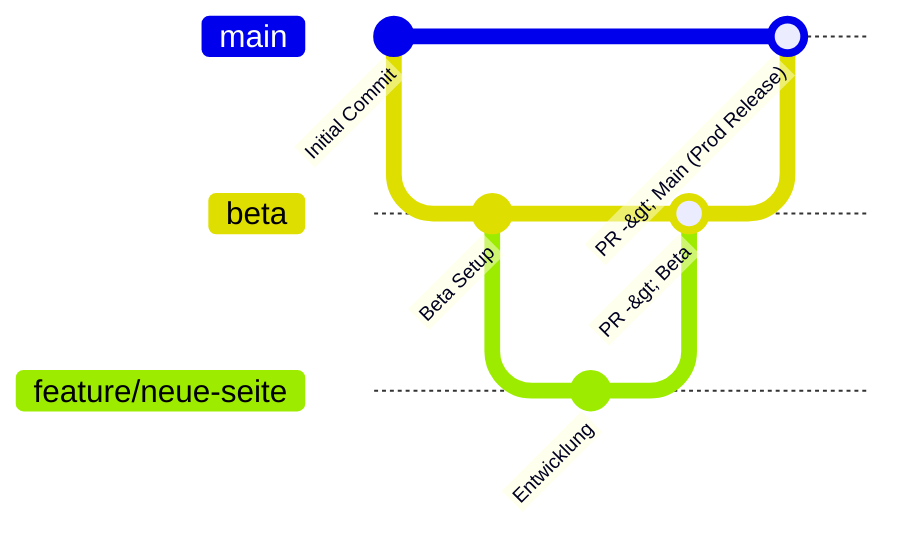

# Branch-Strategie & Deployment-Pipeline

Dieses Dokument definiert das Branching-Modell, die Branch-Protection-Regeln sowie die automatische Deployment-Zuordnung zum Caddy Reverse Proxy für den SprachCafé Relaunch.

---

## 1. Branch-Modell & Umgebungs-Mapping

Das Repository nutzt ein strukturierte Git-Branching-Modell für **Production**, **Beta** und **Features**:



### Branches & Server-Pfade

| Branch | Ziel-Domain | Server-Ordner | Zweck / Beschreibung |
|--------|-------------|---------------|----------------------|
| **`main`** | `sprachcafe-polnisch.org` | `/var/www/production` | **Produktivsystem**: Geschützt via Branch Protection. Automatisiertes Production-Deployment nach PR-Merge. |
| **`beta`** | `beta.sprachcafe-polnisch.org` | `/var/www/beta` | **Staging / Testsystem**: Integration neuer Features. Automatisiertes Beta-Deployment nach Push/Merge. |
| **`feature/*`** | - | - | **Features**: Entwicklung einzelner Funktionen. Brancht von `beta` ab. Merge via PR nach `beta`. |
| **`fix/*` / `hotfix/*`** | - | - | **Bugfixes**: Behebung von Fehlern. Brancht von `beta` oder `main`. Merge via PR. |

---

## 2. Caddy Reverse Proxy Routing Integration

Die Routing-Logik in [`infra/Caddyfile`](../infra/Caddyfile) ist direkt an die Server-Ordner gekoppelt:

```caddy
# Production: sprachcafe-polnisch.org
sprachcafe-polnisch.org {
    root * /var/www/production/frontend/dist
    file_server
    handle_path /admin* {
        reverse_proxy cms:8055
    }
}

# Beta: beta.sprachcafe-polnisch.org
beta.sprachcafe-polnisch.org {
    root * /var/www/beta/frontend/dist
    file_server
    header X-Robots-Tag "noindex, nofollow, noarchive"
    handle_path /admin* {
        reverse_proxy cms:8055
    }
}
```

---

## 3. Branch Protection Regeln für `main`

Um höchste Stabilität für `sprachcafe-polnisch.org` zu garantieren, gelten für den **`main`** Branch folgende Schutzregeln:

### 🔒 Schutzbestimmungen für `main`
1. **Keine direkten Pushes erlaubt (`Restrict direct pushes`)**:
   - Direkte Pushes auf `main` sind für alle Benutzer (inklusive Administratoren) blockiert.
   - Codeänderungen können **ausschließlich über Pull Requests** eingebracht werden.
2. **Pull Request Pflicht (`Require a pull request before merging`)**:
   - Mindestens **1 genehmigtes Review** (Approving Review) erforderlich.
   - Veraltete Genehmigungen werden bei neuen Commits automatisch verworfen (`Dismiss stale pull request approvals when new commits are pushed`).
3. **Erfolgreiche Status-Checks erforderlich (`Require status checks to pass before merging`)**:
   - `Build & Test Frontend (Astro)`
   - `Validate Infrastructure (Docker & Caddy & Terraform)`
   - Branch muss vor dem Mergen auf dem neuesten Stand von `main` sein (`Require branches to be up to date before merging`).
4. **Schutz vor Überschreiben & Löschen**:
   - Direct force pushes verboten (`Do not allow force pushes`).
   - Branch darf nicht gelöscht werden (`Do not allow deletions`).
5. **Erzwingung für Administratoren (`Enforce all above rules for administrators`)**:
   - Regeln gelten uneingeschränkt auch für Repository-Admins.

---

## 4. Einrichtung der Branch Protection in GitHub

Die Regelsätze können über GitHub Web UI oder die GitHub CLI (`gh`) eingerichtet werden:

### GitHub CLI Command:
```bash
gh api \
  --method PUT \
  -H "Accept: application/vnd.github+json" \
  /repos/sprachcafe/sprachcafe-relaunch/branches/main/protection \
  -f required_status_checks='{"strict":true,"contexts":["Build & Test Frontend (Astro)","Validate Infrastructure (Docker & Caddy & Terraform)"]}' \
  -f enforce_admins=true \
  -f required_pull_request_reviews='{"dismiss_stale_reviews":true,"require_code_owner_reviews":true,"required_approving_review_count":1}' \
  -f restrictions=null
```

---

## 5. GitHub Actions Automation Trigger (`.github/workflows/ci-cd.yml`)

Workflow-Trigger sind wie folgt für die Pipeline definiert:

```yaml
on:
  push:
    branches: [ main, beta ]
  pull_request:
    branches: [ main, beta ]
```

### Trigger-Matrix:

| Event | Branch | Aktionen |
|-------|--------|----------|
| `pull_request` | `main` oder `beta` | Führt Linting, Astro Build-Test & Infrastructure Verification aus. (Kein Deployment). |
| `push` | `beta` | Prüft Code & deployt nach `/var/www/beta` für `beta.sprachcafe-polnisch.org`. |
| `push` | `main` | Prüft Code & deployt nach `/var/www/production` für `sprachcafe-polnisch.org`. |
