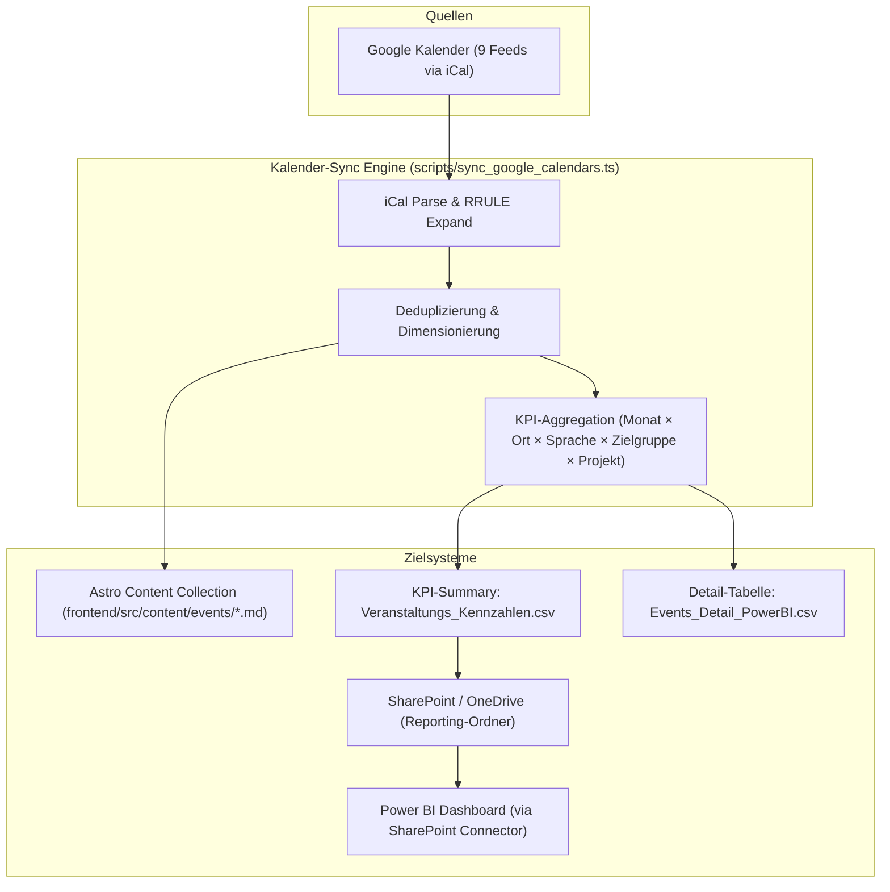

# Automatisierter Kalender-KPI-Sync & Power BI Anbindung

- **Dokument-ID**: `/docs/CALENDAR_KPI_POWERBI_SYNC.md`
- **Status**: Implementiert & Produktiv
- **Datum**: 2026-08-19
- **Komponente**: `scripts/sync_google_calendars.ts`
- **Zielsysteme**: Astro Frontend (`content/events`), SharePoint Dokumentenbibliothek / Liste, Power BI Desktop / Service

---

## 1. Übersicht & Architektur

Der Kalender-Sync (`scripts/sync_google_calendars.ts`) liest automatisiert alle 9 öffentlichen Google-Kalender des Vereins aus und erzeugt bei jedem Build-Lauf zwei Ergebnisse:
1. **Astro Content Collection (`frontend/src/content/events/*.md`)**: Markdown-Dateien für den interaktiven Veranstaltungskalender auf der Website (`/veranstaltungen/`).
2. **Kompakte KPI- & Reporting-Tabellen (`scripts/kpi_exports/`)**: Aggregierte und detaillierte Kennzahlen für Projektabrechnungen und das Power-BI-Reporting.



---

## 2. Struktur der erzeugten Kennzahlen-Tabellen

### A. Aggregierte KPI-Tabelle (`Veranstaltungs_Kennzahlen.csv`)
*Speicherort: `scripts/kpi_exports/Veranstaltungs_Kennzahlen.csv` & `frontend/public/data/calendar-kpi-summary.csv`*

| Spaltenname | Datentyp | Beispielwert | Beschreibung |
| :--- | :--- | :--- | :--- |
| `Jahr_Monat` | Text | `2026-09` | Sortierbarer Perioden-Schlüssel (YYYY-MM) |
| `Jahr` | Zahl | `2026` | Kalenderjahr |
| `Monat_Nummer` | Zahl | `9` | Monat (1–12) |
| `Monat_Name` | Text | `September` | Monatsname für Berichte & Charts |
| `Standort_Code` | Text | `pankow` | Technischer Standort-Identifier (`pankow`, `schoeneberg`, `koepenick`, `partnerorte`, `online`) |
| `Standort_Name` | Text | `Pankow (Schulzestraße / Stadtteilzentrum)` | Lesbarer Standortname für Nachweise |
| `Sprache` | Text | `Polnisch / Deutsch` | Durchgeführte Veranstaltungssprache |
| `Zielgruppe` | Text | `Kinder & Eltern` | Zielgruppe (`Kinder & Eltern`, `Erwachsene & Familien`, `Alle Interessierten`) |
| `Kategorie` | Text | `Kinder & Familie` | Inhaltsrubrik (`Kinder & Familie`, `Sprachpraxis & Tandem`, `Kunst, Kultur & Literatur`, `Ehrenamt & Vereinsleben`) |
| `Projekt` | Text | `Regulärer Vereinsbetrieb` | Förderprojekt-Identifier (z. B. aus Hashtag `#projekt-sdpz26`) |
| `Anzahl_Veranstaltungen` | Zahl | `12` | Anzahl durchgeführter Termine in dieser Dimension |

### B. Detaillierte Event-Liste (`Events_Detail_PowerBI.csv`)
*Speicherort: `scripts/kpi_exports/Events_Detail_PowerBI.csv`*

Enthält jeden einzelnen Termin mit Datum, Beginn- und Endzeit, Dauer in Minuten, Wochentag, Titel und Kalenderquelle für tiefergehende Drill-Down-Analysen.

---

## 3. Power BI Integration (SharePoint-Connector)

Power BI benötigt **keine direkte Google-Calendar-API-Anbindung**, keine API-Schlüssel und keine zusätzliche Cloud-Infrastruktur. Die Daten werden über den standardmäßigen M365 SharePoint-Connector eingelesen.

### Schritt-für-Schritt-Anbindung in Power BI Desktop:

1. **Daten abrufen**:
   - In Power BI Desktop auf **Daten abrufen $\rightarrow$ Weitere... $\rightarrow$ SharePoint-Ordner** (oder *SharePoint-Online-Liste*) klicken.
2. **SharePoint Site URL eingeben**:
   - URL: `https://sprachcafepolnisch.sharepoint.com/sites/intranet`
3. **Authentifizierung**:
   - **Organisationskonto** (Microsoft 365 Vereins-Login) auswählen.
4. **Datei auswählen & Transformieren**:
   - Zur Datei `Reporting/Veranstaltungs_Kennzahlen.csv` navigieren.
   - Die CSV ist mit **UTF-8 mit BOM** codiert und wird von Power BI direkt mit Umlauten und korrekten Spaltentypen erkannt.
5. **Geplanter Refresh**:
   - Im Power BI Service den täglichen Refresh aktivieren. Jedes Mal, wenn der Kalender-Sync läuft, aktualisieren sich die Auswertungen automatisch.

---

## 4. Automatischer Upload nach SharePoint via Webhook

Falls der Sync im CI/CD-Runner (GitHub Actions) oder als Cronjob läuft, kann der Upload nach SharePoint vollautomatisch über einen Power Automate Webhook erfolgen:

1. **Umgebungsvariable setzen**:
   ```bash
   export SHAREPOINT_REPORTING_WEBHOOK="https://prod-xx.germany.logic.azure.com/workflows/..."
   ```
2. **Ablauf**:
   - `sync_google_calendars.ts` sendet nach erfolgreichem Build einen `POST`-Request mit der Base64-codierten CSV und den Zeilendaten an Power Automate.
   - Der Power-Automate-Flow legt die Datei im SharePoint-Ordner `/Freigegebene Dokumente/Reporting/Veranstaltungs_Kennzahlen.csv` ab oder aktualisiert die SharePoint-Liste `Veranstaltungs_Kennzahlen`.

---

## 5. Vorteile dieser Architektur

- **Zero-Config in Power BI**: Standard-SharePoint-Connector ohne Custom Connectors oder Gateway.
- **Konsistenz**: Exakt dieselben Daten, die Besucher auf der Website (`/veranstaltungen/`) sehen, liegen den Verwendungsnachweisen zugrunde.
- **Auditsicherheit**: Alle Zahlen sind monats- und dimensionsgenau für Zuwendungsgeber (Bezirk Pankow, Senat, BKM, SdpZ) belegbar.
