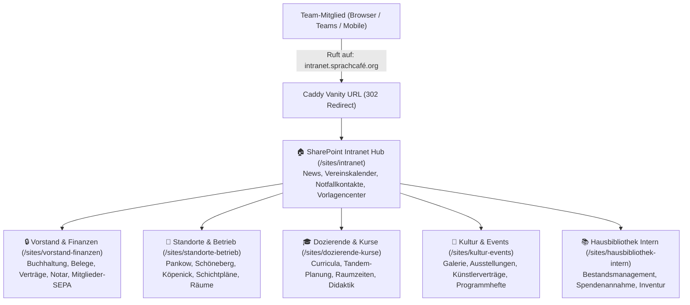
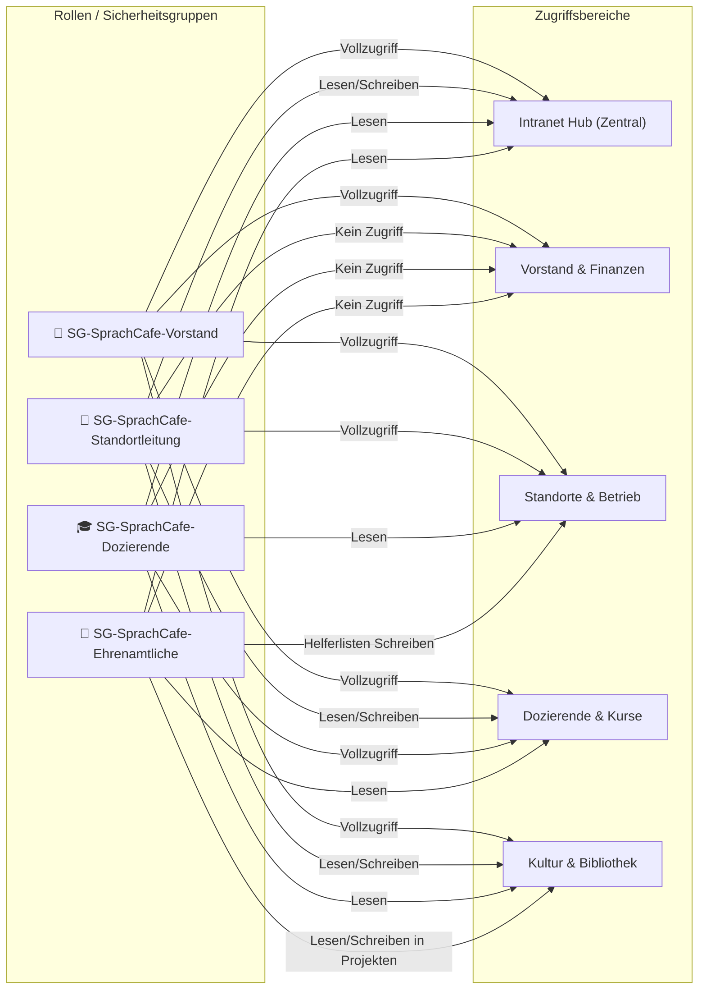

# Microsoft 365 SharePoint Intranet Architektur & Betriebsleitfaden

- **Projekt**: SprachCafé Polnisch e.V. – Internes Intranet & Dokumentenmanagement
- **Einstiegs-URL**: `http://intranet.xn--sprachcaf-j4a.org/` bzw. `https://intranet.sprachcafe-polnisch.org/`
- **Ziel-Plattform**: Microsoft 365 SharePoint Online (`https://sprachcafepolnisch.sharepoint.com/sites/intranet`)
- **Stand**: August 2026

---

## 1. Zielsetzung & Nutzen für das SprachCafé-Team

Das interne Intranet dient als **zentrale Informationsquelle und strukturierter Dokumentenspeicher** für alle Mitarbeiter:innen, Vorstandsmitglieder, Dozierenden und Ehrenamtlichen des SprachCafé Polnisch e.V. über alle 3 Berliner Standorte hinweg:

### Kernfunktionen:
1. **Zentraler Einstiegspunkt (Vanity URL)**:
   - Mitarbeiter tippen einfach `intranet.sprachcafé.org` in den Browser ein und landen direkt auf der gesicherten SharePoint-Startseite mit Single Sign-On (SSO).
2. **Vermeidung von Dokumenten-Chaos**:
   - Strukturierte Bibliotheken statt unübersichtlicher lokaler Ordner oder E-Mail-Anhänge.
   - Standardisierte Metadaten (Standort, Dokumenttyp, Sprache, Status).
3. **Rollenspezifischer Datenschutz & Zugriffsschutz**:
   - Vertrauliche Finanz-, Notariats- und Personaldaten bleiben ausschließlich dem Vorstand vorbehalten.
   - Ehrenamtliche und Dozenten sehen genau die Dokumente und Arbeitsvorlagen, die sie für ihre Arbeit benötigen.
4. **Effektive Zusammenarbeit in Echtzeit**:
   - Gleichzeitiges Bearbeiten von Word-, Excel- und PowerPoint-Dokumenten im Browser oder auf Mobilgeräten.

---

## 2. Hub-Site & Bereichs-Architektur

Das Intranet ist nach dem modernen **Hub-and-Spoke-Modell** strukturiert:



### Übersicht der SharePoint-Sites:

| Site-Name | URL-Pfad | Typ | Hauptzweck & Inhalte |
|---|---|---|---|
| **Intranet Hub (Start)** | `/sites/intranet` | Communication Site (Hub) | Vereinsweite Neuigkeiten, Termine, zentrale Ansprechpartner, Link-Dashboard, Vorlagensammlung. |
| **Vorstand & Finanzen** | `/sites/vorstand-finanzen` | Team Site (Vertraulich) | Buchhaltung, Steuererklärungen, Bankbelege, SEPA-Mandate, Vereinsregister-Akten, Sitzungsprotokolle. |
| **Standorte & Betrieb** | `/sites/standorte-betrieb` | Team Site | Pankow, Schöneberg, Köpenick: Schichtpläne, Raumbelegungen, Schlüsselverzeichnis, Hausordnungen. |
| **Dozierende & Sprachkurse** | `/sites/dozierende-kurse` | Team Site | Unterrichtsmaterialien, Einstufungstests, Dozentenleitfäden, Raumpläne. |
| **Kultur, Galerie & Events** | `/sites/kultur-events` | Team Site | Vernissagen-Planung, Pressemitteilungen, Künstlerabsprachen, Veranstaltungsflyer. |
| **Hausbibliothek Team** | `/sites/hausbibliothek-intern` | Team Site | Interne Listen zur Katalogisierung, Buchspenden-Protokolle, Ausleihstatistiken. |

---

## 3. 4-Stufiges Berechtigungs- und Rollenmodell

Zur sauberen Rechteverwaltung kommen **Entra ID Sicherheitsgruppen** zum Einsatz:



---

## 4. Standardisierte Metadaten & Vorlagen-Governance

In allen Dokumentenbibliotheken sind einheitliche Metadaten-Spalten hinterlegt, die das Auffinden, Filtern und Sortieren erleichtern:

### Metadaten-Taxonomie:
1. **Standort**:
   - `Pankow (Schulzestr. 1)`
   - `Schöneberg (Hauptstr. 121 / Gotenstr. 45)`
   - `Köpenick (Am Wiesengraben 7a)`
   - `Übergeordnet / Alle Standorte`
2. **Dokumenttyp**:
   - `Protokoll & Beschluss`
   - `Vertrag & Vereinbarung`
   - `Vorlage & Formular`
   - `Rechnung & Beleg`
   - `Konzept & Projektantrag`
   - `Presse- & Marketingmaterial`
   - `Leitfaden & How-To`
3. **Sprache**:
   - `Deutsch (DE)`
   - `Polnisch (PL)`
   - `Englisch (EN)`
   - `Zweisprachig (DE/PL)`
4. **Status**:
   - `Entwurf`
   - `In Prüfung / Review`
   - `Freigegeben / Gültig`
   - `Archiviert`

---

## 5. CLI & Automatisierungs-Werkzeuge

Im Projekt stehen gebrauchsfertige CLI-Skripte zur Verfügung:

### 1. Bereitstellung der Sites & Sicherheitsgruppen via PowerShell 7:
```bash
# Ausführung des M365 Provisioning-Skripts
pwsh scripts/m365_provision_intranet.ps1
```

### 2. Synchronisation von Logos, CI-Vorlagen und PDFs nach SharePoint:
```bash
# Asset-Vorbereitung & Sync-Report
npx tsx scripts/upload_brand_assets_to_sharepoint.ts
```

### 3. Caddy Vanity URL Konfiguration:
Die Weiterleitung von `http://intranet.xn--sprachcaf-j4a.org/` und `https://intranet.sprachcafe-polnisch.org/` auf die SharePoint-Hub-URL ist im zentralen Caddyfile hinterlegt und aktiv.
