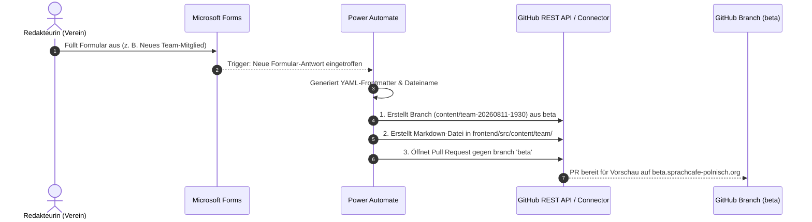

# M365 Redaktions-Workflows (MS Forms ➔ Power Automate ➔ GitHub Pull Request)

> **Architektur-Ziel**: Ehrenamtliche Redakteur:innen pflegen neue Inhalte (Team-Mitglieder, Ausstellungen, Laden-Artikel) **ausschließlich über vertraute Microsoft Forms Formulare**. 
> Es sind **keinerlei Git-Kenntnisse, GitHub-Logins oder Terminal-Zugriffe erforderlich**. Power Automate verarbeitet die Formulareingaben automatisch, erstellt einen eigenen Feature-Branch und öffnet einen Pull Request gegen die Staging-Umgebung (`beta`).

---

## 📌 Workflow-Übersicht



---

## 📋 1. Microsoft Forms (Aktivierte Vereins-Formulare)

Die nachfolgenden Microsoft Forms Formulare sind für das Redaktionsteam eingerichtet:

### Formular 1: `Neues Team-Mitglied anlegen`
- 🔗 **Formular-Link**: [https://forms.cloud.microsoft/Pages/ResponsePage.aspx?id=CqhFt4L25EW6LtSLvZ5wPZc9f-Yj5GpMoZYjm79OAKdURTBESVhTRldGWFhTNzk2QTZFQTdaNTIxRC4u](https://forms.cloud.microsoft/Pages/ResponsePage.aspx?id=CqhFt4L25EW6LtSLvZ5wPZc9f-Yj5GpMoZYjm79OAKdURTBESVhTRldGWFhTNzk2QTZFQTdaNTIxRC4u)
- 🆔 **Form ID**: `CqhFt4L25EW6LtSLvZ5wPZc9f-Yj5GpMoZYjm79OAKdURTBESVhTRldGWFhTNzk2QTZFQTdaNTIxRC4u`
- **Erfasste Felder**:
  1. Vollständiger Name
  2. Rolle / Funktion (DE, PL, EN)
  3. E-Mail & Telefonnummer
  4. Profilfoto-URL (S3 / Cloud)
  5. Biografie (DE, PL, EN)
  6. Sortier-Reihenfolge

---

### Formular 2: `Neue Ausstellung / Galerie eintragen`
- 🔗 **Formular-Link**: [https://forms.cloud.microsoft/Pages/ResponsePage.aspx?id=CqhFt4L25EW6LtSLvZ5wPZc9f-Yj5GpMoZYjm79OAKdUME1NN0xVOEw4M1dNNUZBUk42N1NaTDQ1RS4u](https://forms.cloud.microsoft/Pages/ResponsePage.aspx?id=CqhFt4L25EW6LtSLvZ5wPZc9f-Yj5GpMoZYjm79OAKdUME1NN0xVOEw4M1dNNUZBUk42N1NaTDQ1RS4u)
- 🆔 **Form ID**: `CqhFt4L25EW6LtSLvZ5wPZc9f-Yj5GpMoZYjm79OAKdUME1NN0xVOEw4M1dNNUZBUk42N1NaTDQ1RS4u`
- **Erfasste Felder**:
  1. Titel der Ausstellung (DE, PL, EN)
  2. Künstler:in / Urheber:in
  3. Startdatum & Enddatum
  4. Beschreibung (DE, PL, EN)
  5. Hauptbild-URL

---

### Formular 3: `Neuer Laden-Artikel eintragen`
- 🔗 **Formular-Link**: [https://forms.cloud.microsoft/Pages/ResponsePage.aspx?id=CqhFt4L25EW6LtSLvZ5wPZc9f-Yj5GpMoZYjm79OAKdUOEpWQUM5SVhJU1Y4RkVBOEkwNTY5UFRQVS4u](https://forms.cloud.microsoft/Pages/ResponsePage.aspx?id=CqhFt4L25EW6LtSLvZ5wPZc9f-Yj5GpMoZYjm79OAKdUOEpWQUM5SVhJU1Y4RkVBOEkwNTY5UFRQVS4u)
- 🆔 **Form ID**: `CqhFt4L25EW6LtSLvZ5wPZc9f-Yj5GpMoZYjm79OAKdUOEpWQUM5SVhJU1Y4RkVBOEkwNTY5UFRQVS4u`
- **Erfasste Felder**:
  1. Artikelname (DE, PL, EN)
  2. Beschreibung (DE, PL, EN)
  3. Preis / Spendenbeitrag
  4. Verfügbarkeit (`in_stock`, `out_of_stock`, `on_request`)
  5. Produktbild-URL

---

## ⚙️ 2. Power Automate Flow-Konfiguration

Erstellen Sie für jedes Formular einen **Automatisierter Flow** in Power Automate.

### Schritt 1: Trigger & Formular-Details abrufen
- **Trigger**: `Beim Übermitteln einer neuen Antwort` (Microsoft Forms) ➔ Formular auswählen.
- **Aktion**: `Antwortdetails abrufen` (Microsoft Forms) ➔ `Antwort-ID` aus Trigger zuweisen.

### Schritt 2: Branch-Namen & Zeitstempel initialisieren
- **Aktion**: `Variable initialisieren`
  - Name: `BranchName`
  - Typ: `Zeichenfolge`
  - Wert: `content/team-@{formatDateTime(utcNow(), 'yyyyMMdd-HHmmss')}`

### Schritt 3: GitHub-Connector Aktionen

#### A) Neuer Branch aus `beta` erstellen (`Create a reference`)
- **Connector**: `GitHub`
- **Aktion**: `Create a reference` / `HTTP-Anforderung an GitHub API`
- **Methode**: `POST`
- **URI**: `https://api.github.com/repos/fuchstv/sprachcafe-relaunch/git/refs`
- **Body**:
  ```json
  {
    "ref": "refs/heads/@{variables('BranchName')}",
    "sha": "@{outputs('Get_beta_branch_SHA')}"
  }
  ```

#### B) Content-Collection Datei erstellen (`Create or update file contents`)
- **Connector**: `GitHub` ➔ `Create or update file contents`
- **Repository**: `fuchstv/sprachcafe-relaunch`
- **Path**: `frontend/src/content/team/@{outputs('Slug')}.md`
- **Branch**: `@{variables('BranchName')}`
- **Message**: `feat(content): add team member @{body('Get_response_details')?['r123']}`
- **Content** (Base64-kodiertes YAML-Frontmatter):
  ```yaml
  ---
  name: "@{body('Get_response_details')?['r123_name']}"
  role:
    de: "@{body('Get_response_details')?['r123_role_de']}"
    pl: "@{body('Get_response_details')?['r123_role_pl']}"
    en: "@{body('Get_response_details')?['r123_role_en']}"
  contact:
    email: "@{body('Get_response_details')?['r123_email']}"
    phone: "@{body('Get_response_details')?['r123_phone']}"
  photo: "@{body('Get_response_details')?['r123_photo']}"
  bio:
    de: "@{body('Get_response_details')?['r123_bio_de']}"
    pl: "@{body('Get_response_details')?['r123_bio_de']}"
    en: "@{body('Get_response_details')?['r123_bio_de']}"
  order: @{body('Get_response_details')?['r123_order']}
  ---
  ```

#### C) Pull Request gegen `beta` erstellen (`Create a pull request`)
- **Connector**: `GitHub` ➔ `Create a pull request`
- **Repository**: `fuchstv/sprachcafe-relaunch`
- **Title**: `[Redaktion] Neues Team-Mitglied: @{body('Get_response_details')?['r123_name']}`
- **Head Branch**: `@{variables('BranchName')}`
- **Base Branch**: `beta`
- **Body**: `Automatisch erstellter PR aus Microsoft Forms. Nach dem Mergen in 'beta' ist der Eintrag auf beta.sprachcafe-polnisch.org sichtbar.`

---

## 🛡️ Sicherheits- & Freigabekonzept

1. **Kein direkter Push auf `main`**: Sämtliche Eingaben fließen zwingend über einen Pull Request gegen den **`beta`** Branch.
2. **Vorschau & Qualitätskontrolle**: Das Team kann den Eintrag auf `beta.sprachcafe-polnisch.org` vor der Freigabe prüfen.
3. **Rechte-Isolierung**: Die Redakteurin füllt lediglich das gewohnte MS-Forms-Formular aus und benötigt kein GitHub-Konto.
