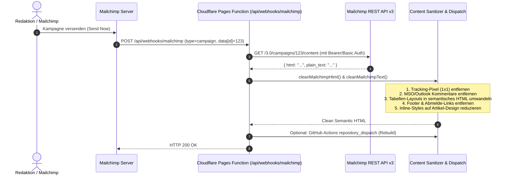

# 📬 Mailchimp Webhook & API Sanitization Guide (Phase M.2)

Dieses Dokument beschreibt die Cloudflare Pages Function für den Mailchimp-Webhook (`GET /campaigns/{id}/content`), den Abruf des Kampagnen-Inhalts über die Mailchimp REST-API sowie die automatische HTML- und Text-Bereinigung für das Web-Layout.

---

## 📋 Architektur-Übersicht



---

## 🔑 1. Mailchimp API-Key als Cloudflare Secret hinterlegen

Der API-Key wird als verschlüsseltes Secret im Cloudflare Pages Projekt hinterlegt:

```bash
# Cloudflare Pages Secret anlegen:
wrangler pages secret put MAILCHIMP_API_KEY --project-name=sprachcafe-redaktion

# Optional: Webhook Secret hinterlegen:
wrangler pages secret put MAILCHIMP_WEBHOOK_SECRET --project-name=sprachcafe-redaktion
```

*Hinweis:* Mailchimp API-Keys haben das Format `<key>-<dc>` (z. B. `abc123def456-us6`). Die Cloudflare Function ermittelt daraus automatisch das zuständige Rechenzentrum (`us6`).

---

## 🧹 2. HTML- & Text-Bereinigung (`_utils/mailchimp.js`)

Die Function [`functions/_utils/mailchimp.js`](../../sprachcafe-redaktion/functions/_utils/mailchimp.js) führt folgende Optimierungen durch:

1. **Tracking-Pixel & Web-Bugs entfernen:**
   - Entfernt `` und `1x1`-Pixel-Grafiken.
2. **Preheader & Browser-Ansichts-Links entfernen:**
   - Entfernt `.mcnPreheader`, `.mcnPreviewText` sowie *„View this email in your browser“*.
3. **E-Mail-Footer & Abmelde-Pflichttexte entfernen:**
   - Entfernt Tabellen mit Klassen wie `.mcnFooterSection`, `.footerContainer`, `.mcnFollowBlock`.
   - Filtert Mailchimp-Merge-Tags (`*|UNSUB|*`, `*|ARCHIVE|*`, `*|LIST:ADDRESS|*`, etc.).
   - Entfernt Standardtexte wie *„You are receiving this email because...“* und postalische Adressblöcke.
4. **MSO- & Outlook-Kommentare bereinigen:**
   - Entfernt `<!--[if mso]>` und alle `mso-*`-Inline-Styles (`mso-line-height-rule`, `mso-table-lspace`).
5. **Tabellen-Layouts in modernes HTML entpacken:**
   - Verschachtelte `<table>`/`<tr>`/`<td>`-Container von E-Mail-Clients werden in saubere `<div class="newsletter-block">`, `<figure>` und `<article>` Elemente überführt.
6. **Typografie & Links:**
   - Bereinigt Schriftart-Overlays zugunsten der Website-Typografie.
   - Links erhalten sichere Attribute (`target="_blank" rel="noopener noreferrer"`).
   - Leere Paragraphen (`<p>&nbsp;</p>`) und überflüssige Zeilenumbrüche werden konsolidiert.

---

## 🧪 3. Automatisierte Tests ausführen

Zur Überprüfung der Bereinigung existiert eine Test-Suite:

```bash
cd /home/ubuntu/sprachcafe-redaktion
node scripts/test-mailchimp-cleaning.js
```

---

## 🚀 4. Deployment auf Cloudflare Pages

```bash
cd /home/ubuntu/sprachcafe-redaktion
npx wrangler pages deploy public --project-name=sprachcafe-redaktion --branch=main
```
