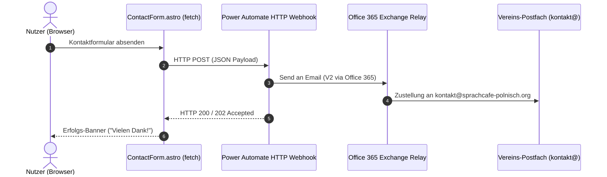

# Power Automate Contact Flow Integration (M365 Exchange Relay & DSGVO-by-Design)

Dieses Dokument beschreibt die Architektur und Konfiguration des Microsoft Power Automate Kontakt-Flows für das Formular ([`ContactForm.astro`](../frontend/src/components/ContactForm.astro)).

---

## 🔒 1. DSGVO-by-Design Prinzip (Zero Database Storage)

- **Keine lokale Speicherung**: Formulardaten werden **zu 0 %** in der Website-eigenen SQLite-Datenbank (`cms.db`) abgelegt.
- **Direktes Webhook-Relay**: Die Daten werden per `fetch()` direkt an den Power Automate HTTP-Webhook gesendet.
- **M365 Exchange Relay**: Power Automate erzeugt serverseitig eine E-Mail und stellt sie direkt an das Vereins-Postfach `kontakt@sprachcafe-polnisch.org` zu.

---

## ⚡ 2. Sequence Diagram



---

## 📥 3. Webhook Request JSON Schema (Power Automate Trigger)

```json
{
  "sender_name": "Jan Nowak",
  "email": "jan.nowak@example.com",
  "topic": "Pankow",
  "subject": "Anfrage zu Sprachkursen",
  "message": "Hallo SprachCafé-Team, ich würde gerne wissen, wann der nächste Polnisch-Sprachabend in Pankow stattfindet.",
  "submitted_at": "2026-08-10T13:51:00.000Z",
  "recipient": "kontakt@sprachcafe-polnisch.org"
}
```

---

## ⚙️ 4. Power Automate Flow-Konfiguration

### Schritt 1: Trigger — `Beim Empfang einer HTTP-Anforderung`
- **Methode**: `POST`

### Schritt 2: Aktion — Office 365 Outlook `E-Mail senden (V2)`
- **An**: `kontakt@sprachcafe-polnisch.org`
- **Antwort an (Reply-To)**: `@{triggerBody()?['email']}`
- **Betreff**: `[Web-Kontakt] @{triggerBody()?['topic']} - @{triggerBody()?['subject']}`
- **Text (HTML)**:
  > **Absender**: @{triggerBody()?['sender_name']} (`@{triggerBody()?['email']}`)
  > **Thema/Standort**: @{triggerBody()?['topic']}
  > **Nachricht**:
  > @{triggerBody()?['message']}
