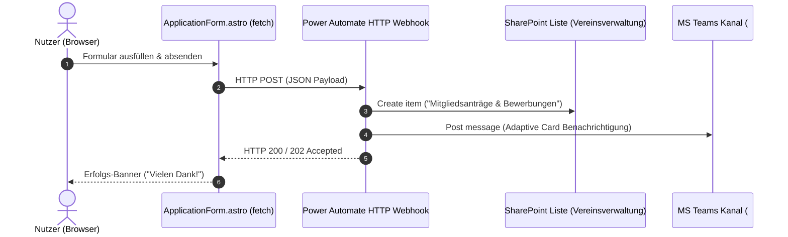

# Power Automate Workflow Integration (Mitgliedsanträge & Bewerbungen)

Dieses Dokument beschreibt die Architektur und Konfiguration des Microsoft Power Automate Flows für das Online-Formular ([`ApplicationForm.astro`](../frontend/src/components/ApplicationForm.astro)).

---

## ⚡ 1. Flow-Architektur (Webhook -> SharePoint -> MS Teams)



---

## 📥 2. Webhook Request JSON Schema (Power Automate Trigger)

Wenn ein Nutzer das Formular auf `/mitmachen/` absendet, sendet der Browser folgenden HTTP POST Request an die Power Automate URL:

```json
{
  "application_type": "mitgliedsantrag",
  "first_name": "Anna",
  "last_name": "Kowalska",
  "email": "anna.kowalska@example.com",
  "phone": "+49 170 1234567",
  "location_preference": "Pankow",
  "motivation": "Ich möchte mich gerne ehrenamtlich als Sprachbegleiterin im SprachCafé Pankow engagieren.",
  "submitted_at": "2026-08-10T13:50:00.000Z",
  "source": "SprachCafé Relaunch Webportal"
}
```

---

## ⚙️ 3. Schritt-für-Schritt Power Automate Flow-Konfiguration

### Schritt 1: Trigger — `Beim Empfang einer HTTP-Anforderung`
- **Methode**: `POST`
- **Relative URL**: Generiert nach dem Speichern des Flows.

### Schritt 2: Aktion — SharePoint `Element erstellen`
- **Websiteadresse**: `https://sprachcafepolnisch.sharepoint.com/sites/Vereinsverwaltung`
- **Listenname**: `Mitgliedsanträge & Bewerbungen`
- **Feld-Mappings**:
  - `Titel`: `@{triggerBody()?['last_name']}, @{triggerBody()?['first_name']}`
  - `E-Mail`: `@{triggerBody()?['email']}`
  - `Telefon`: `@{triggerBody()?['phone']}`
  - `Antragstyp`: `@{triggerBody()?['application_type']}`
  - `Standort`: `@{triggerBody()?['location_preference']}`
  - `Nachricht`: `@{triggerBody()?['motivation']}`

### Schritt 3: Aktion — Microsoft Teams `Nachricht als Flow-Bot in einem Kanal veröffentlichen`
- **Team**: `SprachCafé Polnisch e.V.`
- **Kanal**: `02-mitglieder-und-ehrenamt`
- **Nachrichtentext**:
  > 📥 **Neuer Antrag eingegangen!**
  > **Name**: Anna Kowalska (`anna.kowalska@example.com`)
  > **Typ**: Mitgliedsantrag (Pankow)
  > **Motivation**: *Ich möchte mich gerne ehrenamtlich...*
