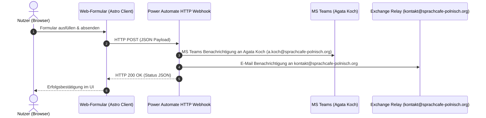

# Power Automate Workflow Integrationen (M365)

Dieses Dokument beschreibt die Architektur, Konfiguration und Bereitstellung aller Microsoft Power Automate Flows für die Webformulare des SprachCafé Polnisch e.V.

---

## ⚡ 1. Übergreifende Flow-Architektur

Alle Web-Formulare senden Eingaben direkt per clientseitigem `fetch()` an die im Azure / M365 Mandanten registrierten HTTP-Webhook-Endpunkte.



---

## 📋 2. Übersicht aller bereitgestellten Flows

| # | Flow-Name | Flow-ID | Auslöser / Formular | Benachrichtigungen |
|---|---|---|---|---|
| **1** | **Mitgliedsantrag** | `9debf567-7b15-4357-b9b8-fdee299cb008` | [`/mitmachen/mitglied-werden/`](https://xn--sprachcaf-j4a.org/mitmachen/mitglied-werden/) | Teams: Agata Koch<br>Mail: `kontakt@` |
| **2** | **Kinder- & Elternanmeldung** | `abf220a8-f754-48e1-affb-953b9f22add3` | [`/events/kinder-und-eltern/`](https://xn--sprachcaf-j4a.org/events/kinder-und-eltern/) | Teams: Agata Koch<br>Mail: `kontakt@` |
| **3** | **Kontaktanfrage** | `b63d0a2a-488b-41ca-a644-350254367840` | [`/kontakt/`](https://xn--sprachcaf-j4a.org/kontakt/) | Teams: Agata Koch<br>Mail: `kontakt@` |
| **4** | **Ehrenamt & Praktikum** | `60637cba-a7a7-49e1-a798-6492094896e5` | [`/mitmachen/#ehrenamt`](https://xn--sprachcaf-j4a.org/mitmachen/#ehrenamt) | Teams: Agata Koch<br>Mail: `kontakt@` |
| **5** | **Barriere melden** | `6a671e20-63c7-4743-961a-91045c0b72cc` | [`/barrierefreiheit/`](https://xn--sprachcaf-j4a.org/barrierefreiheit/) | Teams: Agata Koch<br>Mail: `kontakt@` |

---

## 🛠️ 3. Deployment & Verwaltung via CLI

Die Bereitstellung und Aktualisierung sämtlicher Flows erfolgt vollautomatisch über das PowerShell-Skript:

```bash
pwsh scripts/deploy_all_form_flows.ps1
```

### Verifikation & Test:
```bash
python3 scripts/test_all_form_webhooks.py
```
Dieses Testskript validiert alle 5 Webhook-Endpunkte mit Testdaten und bestätigt die Antwort mit `HTTP 200 OK`.

---

## 🔒 4. DSGVO-Konformität (Privacy-by-Design)

- **Keine lokale Datenbank:** Formulardaten werden nicht auf dem Webserver gespeichert.
- **Verschlüsselte Übertragung:** Alle Übertragungen laufen TLS-verschlüsselt (HTTPS) direkt in die zertifizierte deutsche Microsoft 365 Cloud.
- **Transparenz:** Vor dem Absenden wird stets die ausdrückliche Einwilligung in die Datenschutzerklärung eingeholt.
