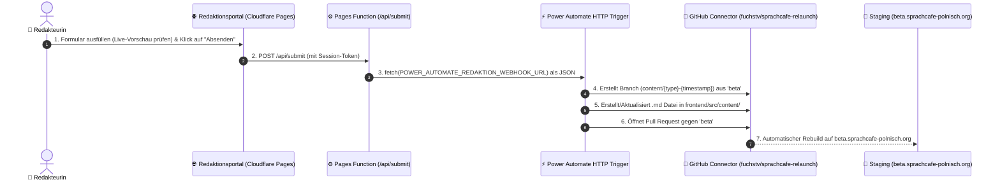

# ⚡ Power Automate Redaktions-Workflow (Formular ➔ Webhook ➔ GitHub PR gegen `beta`)

Dieses Dokument beschreibt die Architektur und Konfiguration des **Power-Automate-HTTP-Webhooks** für die drei Redaktionsformulare (Team, Ausstellung, Laden).

---

## 📌 1. Architektur-Übersicht



---

## 📥 2. Webhook JSON Schema (Power Automate Trigger)

### Trigger-Einstellung in Power Automate:
* **Trigger-Typ:** `Beim Empfang einer HTTP-Anforderung` (Request)
* **Methode:** `POST`
* **Anforderungstext-JSON-Schema:**

```json
{
  "$schema": "http://json-schema.org/draft-07/schema#",
  "type": "object",
  "properties": {
    "content_type": {
      "type": "string",
      "enum": ["team", "exhibition", "shop"]
    },
    "submitted_at": {
      "type": "string"
    },
    "source": {
      "type": "string"
    },
    "summary": {
      "type": "string"
    },
    "data": {
      "type": "object",
      "properties": {
        "name": { "type": "string" },
        "role": { "type": "string" },
        "email": { "type": "string" },
        "phone": { "type": "string" },
        "bio": { "type": "string" },
        "photo": { "type": "string" },
        "title": { "type": "string" },
        "artist": { "type": "string" },
        "startDate": { "type": "string" },
        "endDate": { "type": "string" },
        "description": { "type": "string" },
        "price": { "type": "string" },
        "availability": { "type": "string" }
      }
    }
  },
  "required": ["content_type", "submitted_at", "data"]
}
```

---

## ⚙️ 3. Schritt-für-Schritt Flow-Ablauf in Power Automate

### Schritt 1: Verzweigung nach Inhaltstyp (`Bedingung` / `Switch`)
Schalten Sie basierend auf `triggerBody()?['content_type']`:

* **Fall 1: `team`**
  * Dateipfad: `frontend/src/content/team/@{toLower(replace(triggerBody()?['data']?['name'], ' ', '-'))}.md`
* **Fall 2: `exhibition`**
  * Dateipfad: `frontend/src/content/exhibitions/@{toLower(replace(triggerBody()?['data']?['title'], ' ', '-'))}.md`
* **Fall 3: `shop`**
  * Dateipfad: `frontend/src/content/shopItems/@{toLower(replace(triggerBody()?['data']?['name'], ' ', '-'))}.md`

---

### Schritt 2: Branch aus `beta` erzeugen
* **Aktion:** `Create a reference` (GitHub Connector)
  * **Repository:** `fuchstv/sprachcafe-relaunch`
  * **Ref:** `refs/heads/content/@{triggerBody()?['content_type']}-@{formatDateTime(utcNow(), 'yyyyMMdd-HHmmss')}`
  * **SHA:** SHA-Hash des aktuellen Heads von `beta`

---

### Schritt 3: Markdown-Datei im Branch erstellen
* **Aktion:** `Create or update file contents` (GitHub Connector)
  * **Repository:** `fuchstv/sprachcafe-relaunch`
  * **Branch:** `content/@{triggerBody()?['content_type']}-@{formatDateTime(utcNow(), 'yyyyMMdd-HHmmss')}`
  * **Message:** `feat(content): add @{triggerBody()?['content_type']} @{triggerBody()?['summary']} via Redaktionsportal`
  * **Content:** Base64-kodiertes YAML-Frontmatter.

---

### Schritt 4: Pull Request gegen `beta` öffnen
* **Aktion:** `Create a pull request` (GitHub Connector)
  * **Repository:** `fuchstv/sprachcafe-relaunch`
  * **Base Branch:** `beta`
  * **Head Branch:** `content/@{triggerBody()?['content_type']}-@{formatDateTime(utcNow(), 'yyyyMMdd-HHmmss')}`
  * **Title:** `[Redaktion] @{triggerBody()?['summary']}`
  * **Body:** `Automatisch erstellter Pull Request aus dem SprachCafé Redaktionsportal. Bitte auf beta.sprachcafe-polnisch.org prüfen.`

---

## 🔒 4. Webhook URL in Cloudflare Pages konfigurieren

Nach dem Speichern des Flows in Power Automate die generierte HTTP-POST-URL kopieren und per Wrangler CLI als Secret hinterlegen:

```bash
wrangler pages secret put POWER_AUTOMATE_REDAKTION_WEBHOOK_URL --project-name=sprachcafe-redaktion
```

Anschließend das Deployment aktualisieren:
```bash
cd /home/ubuntu/sprachcafe-redaktion && wrangler pages deploy ./public --project-name=sprachcafe-redaktion --branch=main
```
