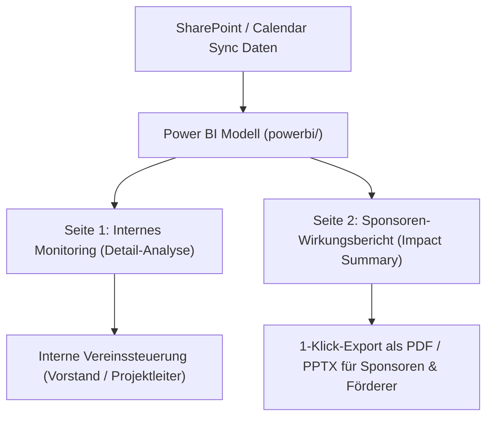

# Power BI Reporting-Handbuch: Internes Monitoring & Sponsoren-Wirkungsbericht

- **Dokument-ID**: `/docs/POWER_BI_REPORT_GUIDE.md`
- **Status**: Produktiv / Betriebsbereit
- **Datum**: 2026-08-19
- **Zielgruppe**: Vereinsvorstand, Projektleitung, Sponsoring & Mittelakquise

---

## 1. Übersicht & 2-Seiten-Konzept

Der Power-BI-Report des SprachCafé Polnisch e.V. wurde auf Basis der tatsächlichen Vereinsdaten (Google Calendar, SharePoint Mitgliederverwaltung) aufgebaut und deckt zwei zentrale Szenarien ab:



---

## 2. Die beiden Berichtsseiten im Detail

### 🔍 Seite 1: Internes Monitoring & Detail-Analyse
- **Zielgruppe**: Vorstand, Projektkoordinatorinnen, Team-Leitung.
- **Inhalte**:
  - 6 Key-Performance-Kacheln: *Gesamtevents, Kinder & Familie, Sprachpraxis, Kultur, Anzahl Standorte, Ø Events/Monat*.
  - Balkendiagramm: *Veranstaltungsdichte pro Standort und Monat*.
  - Donut-Chart: *Aufschlüsselung nach Inhaltsrubriken*.
  - Detaillierte Matrix: *Monat × Standort × Zielgruppe × Förderprojekt × Event-Count*.
- **Einsatz**: Monatscontrolling, Kapazitätsplanung der Räume, Ermittlung von Betreuungsbedarfen.

### 🌟 Seite 2: Sponsoren & Förderer Wirkungsbericht
- **Zielgruppe**: Sponsoren, Förderer (Bezirk Pankow, Senat, Stiftungen, SdpZ, BKM), Spendenbeirat.
- **Inhalte**:
  - **4 prominente Impact-Kacheln**:
    - **135+ Veranstaltungen**
    - **100 % Zweisprachigkeitsquote** (bilingual PL/DE)
    - **5 Standorte & Bezirke** in Berlin abgedeckt
    - **> 2.500 monatliche Kontakte** (Website & Vor-Ort-Community)
  - Visualisierte Standort- und Themenverteilung.
  - Offizieller Vereinsnachweis mit Gemeinnützigkeit, Datenschutz-Garantie (DSGVO-by-Design) und Kontakt.
- **Einsatz**: Antragsanhänge, Zwischenberichte, Sponsorenmappen, Präsentationen auf Mitgliederversammlungen.

---

## 3. Export als PDF und PowerPoint (Für Partner ohne Power BI Zugang)

Sponsoren und Förderer benötigen **weder ein Microsoft-Konto noch eine Power-BI-Lizenz**. Der Bericht kann auf zwei Wegen exportiert werden:

### Weg A: Export aus Power BI Desktop / Power BI Service
1. Im Menüband auf **Datei $\rightarrow$ Exportieren $\rightarrow$ Als PDF exportieren** klicken (oder im Power BI Service: **Exportieren $\rightarrow$ PowerPoint / PDF**).
2. Beim Export der Seite 2 wird ein hochauflösendes, druckfertiges 16:9-Handout erzeugt.

### Weg B: Integrierte Web-Preview (1-Klick im Browser)
Für Vorstandsmitglieder auf Linux/Mac oder unterwegs steht eine pixelgenaue, druckfertige Web-Version zur Verfügung:
- **Sponsoren-Wirkungsbericht**: [`/reports/sponsoren-wirkungsbericht.html`](file:///home/ubuntu/sprachcafe-relaunch/frontend/public/reports/sponsoren-wirkungsbericht.html)
- **Internes Monitoring**: [`/reports/internes-monitoring.html`](file:///home/ubuntu/sprachcafe-relaunch/frontend/public/reports/internes-monitoring.html)

*Tipp: Einfach `Ctrl+P` (oder auf den Button „Als PDF / Druck exportieren“ klicken), Format „Querformat / Landscape“ wählen und als PDF speichern.*

---

## 4. Projekt- und Dateistruktur im Repository

Alle Power-BI-Quellen sind im Monorepo versioniert:

```
sprachcafe-relaunch/
├── powerbi/
│   ├── SprachCafe_Reporting.pbip               # Power BI Project Root
│   ├── SprachCafe_Theme.json                   # CI/CD Brand-Theme (Farben & Schriftarten)
│   ├── PowerQuery_Queries.m                    # M-Queries für SharePoint-Konnektor
│   ├── SprachCafe_Reporting.Report/
│   │   ├── definition.pbir                     # Report-Pointer
│   │   └── report.json                         # 2-Seiten Report-Definition & Visuals
│   └── SprachCafe_Reporting.Dataset/
│       ├── definition.pbism                    # Dataset-Pointer
│       └── model.bim                           # Semantisches Tabular-Modell & DAX-Measures
├── scripts/
│   ├── kpi_exports/
│   │   ├── Veranstaltungs_Kennzahlen.csv       # Aggregierte Datenbasis (UTF-8 BOM)
│   │   └── Events_Detail_PowerBI.csv           # Detaillierte Einzeltermine
│   └── generate_powerbi_previews.ts            # Web-/PDF-Export-Generator
```

---

## 5. Wartung & Automatisierung

- **Daten-Aktualisierung**: Jedes Mal, wenn der Kalender-Sync (`scripts/sync_google_calendars.ts`) bei einem Site-Build oder Cronjob läuft, werden die CSV-Dateien und die Web-Previews automatisch aktualisiert.
- **Power BI Refresh**: Im Power BI Service den täglichen Refresh einrichten – die SharePoint-Datei wird automatisch neu eingelesen.
