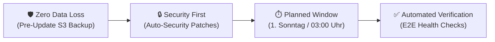
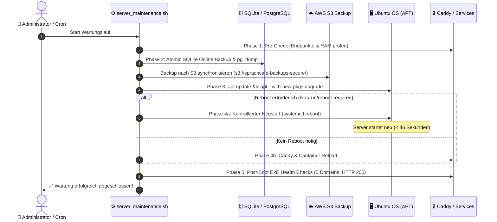

# 🔄 SprachCafé Polnisch e.V. – Server-Wartungs-, Update- & Reboot-Konzept

> **Gültig ab:** 2026  
> **Server-Umgebung:** AWS EC2 Ubuntu 24.04 LTS (`noble`, IP: `3.66.205.213`, `eu-central-1`)  
> **Workloads:** Caddy 2 Auto-TLS, Astro 5 SSG, Hausbibliothek (PHP 8.4 + SQLite WAL), Dienstplan Node.js, Fastify Kurse, Listmonk Newsletter, S3-Backups.

---

## 📑 Inhaltsverzeichnis
1. [Übersicht & Leitprinzipien](#1-übersicht--leitprinzipien)
2. [Das Hybride 3-Stufen-Wartungsmodell](#2-das-hybride-3-stufen-wartungsmodell)
3. [Reguläres Wartungsfenster (Maintenance Window)](#3-reguläres-wartungsfenster-maintenance-window)
4. [Der 4-Phasen Wartungsablauf](#4-der-4-phasen-wartungsablauf)
5. [Kernel-Upgrades & Kontrollierte Reboots](#5-kernel-upgrades--kontrollierte-reboots)
6. [Major Ubuntu Upgrades (24.04 ➔ 26.04 LTS)](#6-major-ubuntu-upgrades-2404--2604-lts)
7. [Post-Boot E2E-Health-Check & Verifikation](#7-post-boot-e2e-health-check--verifikation)
8. [Automatisierungs-Tooling & CLI-Befehle](#8-automatisierungs-tooling--cli-befehle)

---

## 1. Übersicht & Leitprinzipien

Um maximale Ausfallsicherheit, Datenschutz (DSGVO) und Performance für das SprachCafé-Webportal und die internen Vereinssysteme zu garantieren, folgt das Wartungskonzept vier Kernprinzipien:



1. **Zero Data Loss:** Vor jeder Paketinstallation oder Kernel-Änderung wird ein atomarer Datenbank-Snapshot (SQLite & PostgreSQL) erstellt und nach AWS S3 synchronisiert.
2. **Security First:** Kritische Sicherheitslücken (`${distro_codename}-security`) werden automatisch im Hintergrund über `unattended-upgrades` geschlossen.
3. **Planbare Wartungsfenster:** Größere Paketupgrades, Kernel-Erneuerungen und Reboots erfolgen ausschließlich in verkehrsarmen Zeitfenstern.
4. **Automatisierte Verifikation:** Nach jedem Update und Neustart prüft ein Skript automatisch alle 5 öffentlichen Endpunkte, Docker-Container und Datenbank-Integritäten.

---

## 2. Das Hybride 3-Stufen-Wartungsmodell

| Stufe | Kategorie | Update-Quelle | Rhythmus & Automatisierung | Reboot-Verhalten |
| :--- | :--- | :--- | :--- | :--- |
| **Stufe 1** | **Kritische Sicherheits-Patches** | `noble-security` | **Täglich vollautomatisch** via `unattended-upgrades` | **Kein automatischer Reboot** (wird vorgemerkt in `/var/run/reboot-required`) |
| **Stufe 2** | **Reguläre Paket- & Kernel-Updates** | `noble-updates` | **Monatlich im Wartungsfenster** via `server_maintenance.sh` | **Kontrollierter Reboot**, falls neuer Kernel aktiv werden muss |
| **Stufe 3** | **Major OS Upgrades** | `do-release-upgrade` (LTS ➔ LTS) | **Alle 2 Jahre** nach vorherigem AWS EBS Volume Snapshot | **Manueller Neustart mit Rollback-Sicherheit** |

---

## 3. Reguläres Wartungsfenster (Maintenance Window)

- **Zeitpunkt:** Jeden **1. Sonntag im Monat zwischen 03:00 und 05:00 Uhr** (MEZ/MESZ).
- **Begründung:** Zu dieser Zeit findet kein Café-, Kurs- oder Veranstaltungsbetrieb statt; Webportal-Zugriffe sind minimal (< 0.1 req/sec).
- **Voraussetzung:** Mindestens ein erfolgreiches S3-Backup in den letzten 24 Stunden.

---

## 4. Der 4-Phasen Wartungsablauf



---

## 5. Kernel-Upgrades & Kontrollierte Reboots

### 5.1 Erkennung von Reboot-Bedarf
Ubuntu legt bei Kernel- oder Core-Lib-Updates automatisch das Flag `/var/run/reboot-required` an:
```bash
# Prüfen, ob ein Neustart aussteht:
[ -f /var/run/reboot-required ] && cat /var/run/reboot-required.pkgs || echo "Kein Neustart erforderlich"
```

### 5.2 Ablauf eines sicheren Server-Neustarts
1. **Dienste prüfen:** Alle Schreibvorgänge abschließen lassen.
2. **Datenbanken flushen:** SQLite WAL Checkpoint durchführen (`PRAGMA wal_checkpoint(TRUNCATE);`).
3. **Reboot ausführen:** `sudo systemctl reboot`.
4. **Dauer:** AWS EC2 Instanzen (`t3.small`/`t4g.small`) starten in der Regel in **unter 40 Sekunden** neu.
5. **Autostart:** Docker-Dienst, Caddy und Systemd-Services starten dank `restart: always` vollautomatisch.

---

## 6. Major Ubuntu Upgrades (24.04 ➔ 26.04 LTS)

Bei künftigen Major-Versionssprüngen (z.B. Ubuntu 24.04 LTS Noble ➔ Ubuntu 26.04 LTS):

1. **AWS EBS Volume Snapshot erstellen:**
   ```bash
   aws ec2 create-snapshot --volume-id vol-XXXXX --description "Pre-Upgrade Ubuntu 26.04 LTS $(date +%Y-%m-%d)"
   ```
2. **Pre-Upgrade DB Backup ausführen:**
   ```bash
   /home/ubuntu/backups/backup_db.sh
   ```
3. **Release-Upgrade durchführen:**
   ```bash
   sudo do-release-upgrade
   ```
4. **Verifikation:** Alle 5 Web-Endpunkte und SQLite-Integrität prüfen.
5. **Fallback bei unerwarteten Fehlern:** Innerhalb von 3 Minuten kann die EC2-Instanz aus dem EBS-Snapshot auf den exakten Ausgangszustand zurückgesetzt werden.

---

## 7. Post-Boot E2E-Health-Check & Verifikation

Nach jedem Neustart oder Wartungslauf werden folgende Kriterien automatisch validiert:

| Prüfpunkt | Erwarteter Sollwert | Prüfbefehl |
| :--- | :--- | :--- |
| **Haupt-Website** (`sprachcafé.org`) | `HTTP 200 OK` | `curl -s -o /dev/null -w "%{http_code}" https://sprachcafé.org` |
| **Beta / Staging** (`beta.sprachcafe-polnisch.org`) | `HTTP 200 OK` | `curl -s -o /dev/null -w "%{http_code}" https://beta.sprachcafe-polnisch.org` |
| **Hausbibliothek** (`hausbibliothek.org`) | `HTTP 200 OK` | `curl -s -o /dev/null -w "%{http_code}" https://hausbibliothek.org` |
| **Dienstplan** (`team.sprachcafé.org`) | `HTTP 200 OK` | `curl -s -o /dev/null -w "%{http_code}" https://team.sprachcafé.org` |
| **Kurse Portal** (`kurse.sprachcafé.org`) | `HTTP 200 OK` | `curl -s -o /dev/null -w "%{http_code}" https://kurse.sprachcafé.org` |
| **Newsletter** (`newsletter.sprachcafé.org`) | `HTTP 200 / 302` | `curl -s -o /dev/null -w "%{http_code}" https://newsletter.sprachcafé.org` |
| **Caddy Container** | Status `running` | `docker ps --filter "name=caddy" --format "{{.Status}}"` |
| **SQLite Integrität** | `ok` | `sqlite3 /home/ubuntu/minimalist_home_library/backend/data/database.sqlite "PRAGMA integrity_check;"` |
| **System-RAM RSS** | `< 1.1 GB` | `free -m` |

---

## 8. Automatisierungs-Tooling & CLI-Befehle

Das zentrale Wartungsskript [`scripts/server_maintenance.sh`](file:///home/ubuntu/sprachcafe-relaunch/scripts/server_maintenance.sh) deckt alle Schritte ab:

```bash
# 1. Systemstatus & anstehende Updates/Reboot-Bedarf prüfen:
sudo ./scripts/server_maintenance.sh --check-only

# 2. Vollständigen Wartungslauf durchführen (Backup + Update + Health-Check):
sudo ./scripts/server_maintenance.sh --full

# 3. Wartungslauf mit automatischem Reboot (nur falls Kernel aktualisiert wurde):
sudo ./scripts/server_maintenance.sh --full --reboot-if-required

# 4. Nur E2E-Health-Check aller 5 Endpunkte ausführen:
./scripts/server_maintenance.sh --health-check
```
