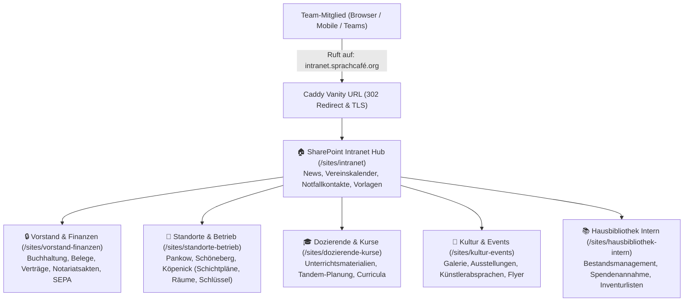

# SharePoint Intranet Bauanleitung & Konfigurations-Leitfaden

- **Organisation**: SprachCafé Polnisch e.V.
- **Intranet-URL (Vanity)**: `http://intranet.xn--sprachcaf-j4a.org/` bzw. `https://intranet.sprachcafe-polnisch.org/`
- **Ziel-Website**: `https://sprachcafepolnisch.sharepoint.com/sites/intranet`
- **Primärfarbe (CI)**: `#8B263E` (SprachCafé Weinrot)
- **Stand**: August 2026

---

## 📌 1. Architektur-Übersicht

Das neue Intranet bündelt die Arbeitsabläufe aller 3 Standorte (*Pankow, Schöneberg, Köpenick*) und aller Teams (*Vorstand, Standorte, Dozenten, Kultur, Hausbibliothek*):



---

## 🎨 2. SprachCafé Corporate Design Theme (#8B263E)

Um das Intranet im offiziellen Erscheinungsbild des SprachCafé Polnisch erstrahlen zu lassen, wird das maßgeschneiderte **Weinrot-Theme** hinterlegt:

### Farbwerte-Matrix:
```json
{
  "themePrimary": "#8B263E",
  "themeLighterAlt": "#faf5f6",
  "themeLighter": "#eed8dc",
  "themeLight": "#dfb7c0",
  "themeTertiary": "#c07887",
  "themeSecondary": "#9a374c",
  "themeDarkAlt": "#7d2238",
  "themeDark": "#6a1d2f",
  "themeDarker": "#4e1523",
  "neutralLighterAlt": "#faf9f8",
  "neutralLighter": "#f3f2f1",
  "neutralLight": "#edebe9",
  "neutralQuaternaryAlt": "#e1dfdd",
  "neutralQuaternary": "#d0d1d5",
  "neutralTertiaryAlt": "#c8c6c4",
  "neutralTertiary": "#595959",
  "neutralSecondary": "#373737",
  "neutralPrimary": "#1d1b1a",
  "neutralDark": "#161514",
  "black": "#0b0a0a",
  "white": "#ffffff"
}
```

---

## 🧭 3. Horizontales Mega-Menü (Top-Navigation)

Das Navigationsmenü oben auf der SharePoint-Site leitet direkt zu allen Arbeitsbereichen und Formularen:

1. **🏠 Startseite** ➔ `https://sprachcafepolnisch.sharepoint.com/sites/intranet`
2. **🔒 Vorstand & Finanzen** ➔ `https://sprachcafepolnisch.sharepoint.com/sites/vorstand-finanzen` *(Nur Vorstand)*
3. **📍 Standorte & Betrieb** *(Dropdown)*:
   - ➔ *Pankow (Schulzestr. 1)*
   - ➔ *Schöneberg (Hauptstr. 121 A / Gotenstr. 45)*
   - ➔ *Köpenick (Am Wiesengraben 7a)*
   - ➔ *📅 Schichtpläne & Schlüsselverwaltung*
4. **🎓 Dozierende & Kurse** ➔ `https://sprachcafepolnisch.sharepoint.com/sites/dozierende-kurse`
5. **🎨 Kultur & Galerie** ➔ `https://sprachcafepolnisch.sharepoint.com/sites/kultur-events`
6. **📚 Hausbibliothek Portal** ➔ `https://hausbibliothek.org`
7. **📦 Vorlagencenter & CI** ➔ `/sites/intranet/Vorlagencenter`
8. **✍️ Redaktions-Formulare** *(Dropdown)*:
   - ➔ *Neues Team-Mitglied anlegen (MS Forms)*
   - ➔ *Neue Ausstellung melden (MS Forms)*
   - ➔ *Neuen Laden-Artikel erfassen (MS Forms)*

---

## 📐 4. Webpart-Layout der Intranet-Startseite

Die Startseite ist in 4 übersichtliche Abschnitte unterteilt:

### Abschnitt 1: Hero Banner (Volle Breite)
- **Titel**: *„Willkommen im Intranet des SprachCafé Polnisch e.V.“*
- **Untertitel**: *„Ort der Begegnung, Sprache und deutsch-polnischen Kultur.“*
- **Hintergrundbild**: Stimmungsbild des Standorts Pankow / BegegnungsCafé.

### Abschnitt 2: Quick Links (6 Kacheln)
| Kachel | Icon / Bild | Ziel-URL | Beschreibung |
|---|---|---|---|
| **Hausbibliothek** | 📚 | `https://hausbibliothek.org` | Digitales Bibliotheksportal & Ausleihverwaltung |
| **Vereinskalender** | 📅 | `/sites/intranet/Kalender` | Termine, Veranstaltungen & Raumbelegungen |
| **Redaktions-Formulare** | ✍️ | MS Forms Links | Neue Teammitglieder, Ausstellungen & Laden |
| **Vorstand & Finanzen** | 🔒 | `/sites/vorstand-finanzen` | Geschützter Bereich für Buchhaltung & Verträge |
| **Standorte & Schichten** | 📍 | `/sites/standorte-betrieb` | Dienstpläne für Pankow, Schöneberg, Köpenick |
| **Vorlagencenter** | 📦 | `/sites/intranet/Vorlagen` | Offizielle Briefbögen, Logos, Formulare, Satzung |

### Abschnitt 3: 2-Spaltiges Dashboard (66% / 33%)
- **Linke Spalte (News)**: *SharePoint News Webpart* – Aktuelle vereinsinterne Ankündigungen, Erfolge, Terminhinweise.
- **Rechte Spalte (Events & Termine)**: *SharePoint Events Webpart* – Nächste Vorstandssitzungen, Schichtübergaben, Vernissagen.

### Abschnitt 4: Notfall- & Ansprechpartner (People Webpart)
- **Agata Koch** – *Vorstandsvorsitzende* (`kontakt@sprachcafe-polnisch.org`)
- **Elke Albers** – *Schatzmeisterin / Finanzen* (`verwaltung@sprachcafe-polnisch.org`)
- **Standortleitung Pankow, Schöneberg & Köpenick**

---

## 📁 5. Dokumentenbibliotheken & Metadatenspalten

In allen Bibliotheken werden einheitliche Metadaten-Spalten gepflegt:

1. **Standort**: `Pankow` \| `Schöneberg` \| `Köpenick` \| `Übergeordnet / Alle`
2. **Dokumenttyp**: `Protokoll` \| `Vertrag` \| `Vorlage` \| `Rechnung & Beleg` \| `Konzept` \| `Pressematerial` \| `Leitfaden`
3. **Sprache**: `Deutsch (DE)` \| `Polnisch (PL)` \| `Englisch (EN)` \| `Zweisprachig (DE/PL)`
4. **Status**: `Entwurf` \| `In Prüfung` \| `Freigegeben` \| `Archiviert`
5. **Vertraulichkeit**: `Öffentlich (Vereinsweit)` \| `Intern (Team)` \| `Vertraulich (Vorstand)`

---

## 🚀 6. Automatisierte Bereitstellung via PowerShell

Zur vollautomatischen Einrichtung im Microsoft 365 Tenant führen Sie folgendes Skript aus:

```bash
pwsh scripts/build_sharepoint_intranet.ps1
```

Das Skript validiert die Verbindung, legt die Theme-Palette an und erzeugt die Spezifikation für die Bibliotheken und Navigationselemente.
