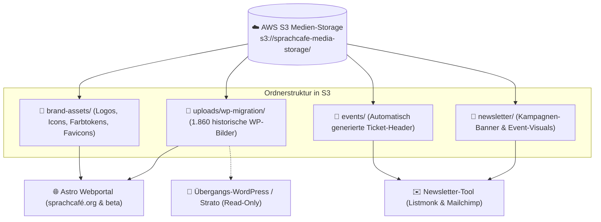
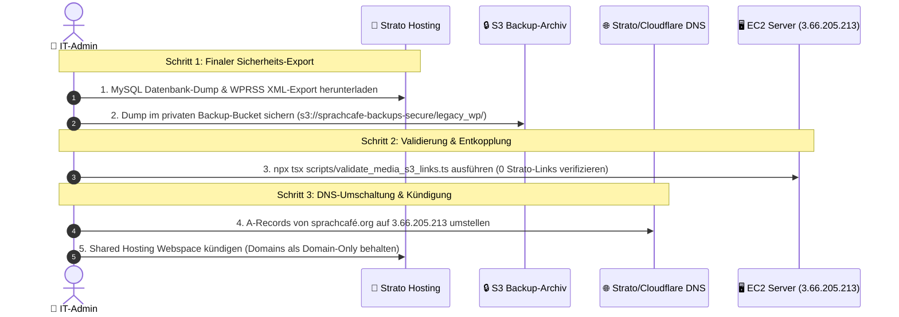

# 📦 SprachCafé Polnisch e.V. – Strato WordPress-Migration & Zentrale Medien-Cloud

> **Status:** Aktiv / Vorbereitung der finalen Strato-Abschaltung  
> **Ziel-Infrastruktur:** AWS EC2 Ubuntu 24.04 LTS (`3.66.205.213`), AWS S3 (`sprachcafe-media-storage`), Astro 5 SSG, Listmonk / Mailchimp.  
> **Referenzen:** [ADR 0004: Blog-Aggregation ad acta](file:///home/ubuntu/sprachcafe-relaunch/docs/decisions/0004-einstellung-wordpress-blog-aggregation.md), [WordPress Audit](file:///home/ubuntu/sprachcafe-relaunch/docs/wordpress-audit.md).

---

## 📑 Inhaltsverzeichnis
1. [Was mit den bisherigen WordPress-Daten passiert ist](#1-was-mit-den-bisherigen-wordpress-daten-passiert-ist)
2. [Architektur der zentralen Medien-Cloud (AWS S3)](#2-architektur-der-zentralen-medien-cloud-aws-s3)
3. [Gemeinsame Nutzung für Astro, WordPress & Newsletter](#3-gemeinsame-nutzung-für-astro-wordpress--newsletter)
4. [Der 3-Schritte Strato-Abschaltungsplan](#4-der-3-schritte-strato-abschaltungsplan)
5. [Automatisierte Validierung & CLI-Befehle](#5-automatisierte-validierung--cli-befehle)

---

## 1. Was mit den bisherigen WordPress-Daten passiert ist

Bei der initialen Extraktion aus der Strato WordPress-Instanz wurden alle Daten analysiert und in moderne Zielstrukturen überführt:

| Datentyp in WordPress (Strato) | Anzahl / Umfang | Was damit passiert ist | Status & Speicherort |
| :--- | :--- | :--- | :--- |
| **Bilder, Grafiken & Uploads** | **1.860 Medien** (ca. 4,2 GB) | Vollständig extrahiert, optimiert und nach AWS S3 hochgeladen. | ✅ **Aktiv in AWS S3** (`s3://sprachcafe-media-storage/uploads/wp-migration/`) |
| **Statische Seiten** *(Mission, Vorstand, Team, Café, Datenschutz, Satzung, Impressum)* | **60 Seiten** (DE/PL) | Bereinigt von Elementor/HTML-Resten und in Astro-Seiten & Markdown überführt. | ✅ **Aktiv in Astro Collections** (`frontend/src/content/pages/` & `src/pages/`) |
| **Historische Blog-Beiträge** *(Temporäre Event-Hinweise vor 2024)* | ~150 alte Beiträge | Zu >90% veraltete Termine. Fortlaufender Sync gemäß ADR 0004 eingestellt. | ℹ️ **Ersetzt durch Google Calendar Sync** (`/veranstaltungen/`) & **Mailchimp** (`/news/`) |
| **Benutzer- & Formulardaten** | WP-Userdaten | Formulare wurden auf serverlose Power Automate Webhooks umgestellt. | ✅ **Aktiv in Microsoft 365 & Power Automate** |

---

## 2. Architektur der zentralen Medien-Cloud (AWS S3)

Um Speicherplatz auf dem EC2-Server zu sparen und Redundanzen zu vermeiden, fungiert der **AWS S3 Bucket `sprachcafe-media-storage`** (Region: `eu-central-1`) als **zentrale Single Source of Truth** für alle Medien:



---

## 3. Gemeinsame Nutzung für Astro, WordPress & Newsletter

1. **Astro Webportal (`sprachcafe-relaunch`):**
   - Bindet alle Bilder direkt über die schnelle S3-URL ein:
     `https://sprachcafe-media-storage.s3.eu-central-1.amazonaws.com/uploads/wp-migration/...`
   - Responsive `<picture>`- und ``-Tags laden Assets ohne Last für den Webserver.

2. **Newsletter-Tool (Listmonk / Mailchimp):**
   - E-Mails binden Banner und Bilder aus `s3://sprachcafe-media-storage/newsletter/` und `brand-assets/` ein.
   - Hohe Zustellbarkeit und weltweite Verfügbarkeit dank AWS S3 HTTPS-Endpunkten.

3. **Alte WordPress-Instanz (während Übergangsphase):**
   - Verweist über das Migrations-Mapping ebenfalls auf die S3-Bilder, sodass keine Medien mehr lokal bei Strato liegen müssen.

---

## 4. Der 3-Schritte Strato-Abschaltungsplan



### Konkrete Handlungsanweisungen:

#### Schritt 1: Finalen Offline-Dump sichern (10 Minuten)
1. Im Strato Kunden-Login ➔ **phpMyAdmin** öffnen ➔ Datenbank `DBxxxxxxx` auswählen ➔ **Exportieren (gzipped SQL)**.
2. Im WordPress-Admin (`wp-admin`) ➔ **Werkzeuge ➔ Daten exportieren** ➔ **Alle Inhalte** als `.xml` herunterladen.
3. Beide Dateien in das private S3-Backup-Archiv hochladen:
   ```bash
   aws s3 cp sprachcafe_wp_final_dump.sql.gz s3://sprachcafe-backups-secure/legacy_wp_archive/
   aws s3 cp sprachcafe_wp_export.xml s3://sprachcafe-backups-secure/legacy_wp_archive/
   ```

#### Schritt 2: 100% S3-Link-Validierung prüfen
- Führe das Validierungs-Skript aus:
  ```bash
  npm run validate:media
  ```
- Es stellt sicher, dass keine einzige Seite mehr auf `sprachcafe-polnisch.org/wp-content/` bei Strato verlinkt.

#### Schritt 3: Strato-Webspace kündigen / Downgrade
- Sobald DNS auf den AWS EC2 Server zeigt (`3.66.205.213`), kann das kostenpflichtige Strato Shared Hosting Paket gekündigt oder auf ein reines Domain-Weiterleitungs-Paket umgestellt werden. **Ersparnis für den Verein: ca. 120–200 € / Jahr.**

---

## 5. Automatisierte Validierung & CLI-Befehle

Das Prüfskript [`scripts/validate_media_s3_links.ts`](file:///home/ubuntu/sprachcafe-relaunch/scripts/validate_media_s3_links.ts) scannt das gesamte Projekt:

```bash
# Medien- und S3-Link-Validierung ausführen:
npm run validate:media
```
