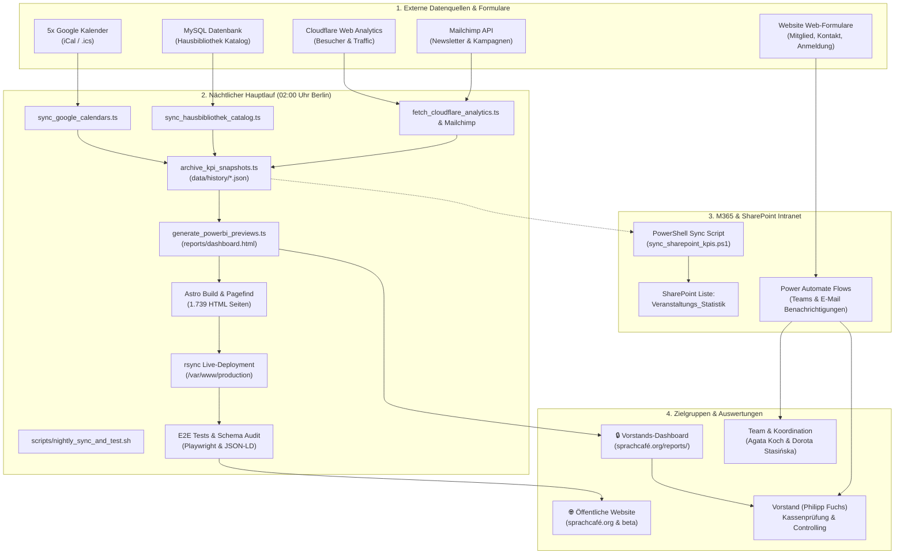

# SprachCafé Polnisch e.V. — Gesamtdokumentation: Synchronisationen, Zeitpläne & Automationen

Dieses Dokument erklärt für das gesamte Team und den Vorstand (**Philipp Fuchs**, **Agata Koch**, **Dorota Stasińska**, **Agnieszka Kubalewska-Strohmeyer**), wie alle Teilsysteme zusammenarbeiten, wann welche Synchronisationen und Tests ausgelöst werden und welche Ergebnisse dabei erzeugt werden.

---

## 🗺️ 1. Architektur- & Datenfluss-Übersicht



---

## ⏰ 2. Zeitgesteuerte Synchronisationen (Scheduled Runs)

### 🌙 Der nächtliche Gesamtlauf (Täglich um 02:00 Uhr Berliner Zeit)
Der gesamte Datenbestand der Website, das Dashboard und alle Qualitätssicherungen werden nachts vollautomatisch über den Cron-Job `/home/ubuntu/sprachcafe-relaunch/scripts/nightly_sync_and_test.sh` ausgeführt.

| Schritt | Uhrzeit | Skript / Komponente | Was passiert? | Erzeugtes Ergebnis / Artefakte |
| :--- | :--- | :--- | :--- | :--- |
| **1. Kalender-Sync** | 02:00:00 | [`scripts/sync_google_calendars.ts`](file:///home/ubuntu/sprachcafe-relaunch/scripts/sync_google_calendars.ts) | Fragt 5 Google-Kalender ab (Pankow, Schöneberg, Köpenick, Kinder), berechnet wiederkehrende Termine (RRULE) und Zielgruppen. | <ul><li>Markdown-Dateien in `frontend/src/content/events/*.md`</li><li>Aggregierte Kennzahlen in `scripts/kpi_exports/Veranstaltungs_Kennzahlen.csv`</li></ul> |
| **2. Bibliotheks-Sync** | 02:00:05 | [`scripts/sync_hausbibliothek_catalog.ts`](file:///home/ubuntu/sprachcafe-relaunch/scripts/sync_hausbibliothek_catalog.ts) | Liest den aktuellen Buchbestand aus der Bibliotheksdatenbank aus. | <ul><li>Buch-Markdown in `frontend/src/content/hausbibliothek/*.md`</li><li>Detailseiten für alle Bücher</li></ul> |
| **3. Web & Newsletter** | 02:00:10 | `fetch_cloudflare_analytics.ts` & `fetch_mailchimp_metrics.ts` | Ruft Webseiten-Traffic, Unique Visitors und Mailchimp-Abonnentenzahlen ab. | <ul><li>`frontend/public/data/cloudflare-analytics.json`</li><li>`frontend/public/data/mailchimp-metrics.json`</li></ul> |
| **4. KPI-Archivierung** | 02:00:15 | [`scripts/archive_kpi_snapshots.ts`](file:///home/ubuntu/sprachcafe-relaunch/scripts/archive_kpi_snapshots.ts) | Sichert unveränderliche monatliche Snapshots im Git-Archiv. | <ul><li>`frontend/public/data/history/YYYY-MM.json`</li><li>`frontend/public/data/history/all-months.json`</li></ul> |
| **5. Dashboard-Build** | 02:00:20 | [`scripts/generate_powerbi_previews.ts`](file:///home/ubuntu/sprachcafe-relaunch/scripts/generate_powerbi_previews.ts) | Erzeugt die interaktive Mehrjahres-Steuerungsansicht und Sponsoren-Berichte. | <ul><li>`frontend/public/reports/dashboard.html`</li><li>`frontend/public/reports/sponsoren-wirkungsbericht.html`</li><li>`frontend/public/reports/internes-monitoring.html`</li></ul> |
| **6. Frontend Static Build** | 02:00:25 | `npm run build` *(Astro & Pagefind)* | Kompiliert die gesamte Webplattform zu statischem HTML/CSS/JS und baut den mehrsprachigen Suchindex. | <ul><li>`frontend/dist/` (1.739 generierte HTML-Seiten)</li><li>`frontend/dist/pagefind/` (Volltextsuch-Index)</li></ul> |
| **7. Live-Deployment** | 02:00:55 | `rsync` | Schaltet das neue Release atomar auf dem Webserver live. | <ul><li>`/var/www/production/` (Live-System)</li><li>`/var/www/beta/` (Beta-System)</li></ul> |
| **8. Automatisierte Tests** | 02:01:00 | `validate-jsonld.js` & `playwright test` | Führt Schema.org-Validierung und Browser-Akzeptanztests durch (Formulare, Kalender, Barrierefreiheit). | <ul><li>Testprotokoll im Log</li><li>Fehlerfreier Exit-Code 0</li></ul> |
| **9. Protokollierung** | 02:03:40 | Logging-Engine | Schreibt Ausführungsdauer und Status in das tägliche Log. | `logs/nightly-sync-YYYY-MM-DD.log` |

---

### 💾 Tägliches Datenbank-Backup (03:00 Uhr Berliner Zeit)
* **Auslöser**: Crontab `0 3 * * * /home/ubuntu/backups/backup_db.sh`
* **Ergebnis**: Dump aller MySQL- und Postgres-Datenbanken nach `/home/ubuntu/backups/`.

---

## ⚡ 3. Ereignisgesteuerte Synchronisationen (Event-Driven Webhooks)

Formulare auf der Website lösen beim Absenden sofortige Aktionen in Microsoft 365 (Power Automate & SharePoint) aus:

| Formular / Ereignis | Route auf Website | Ausgelöster Power Automate Flow | Ergebnis & Benachrichtigung |
| :--- | :--- | :--- | :--- |
| **Mitgliedsantrag** (4-Stufen-Formular) | [`/mitmachen/mitglied-werden/`](https://xn--sprachcaf-j4a.org/mitmachen/mitglied-werden/) | `SprachCafé - Mitgliedsantrag` | <ul><li>MS Teams Karte an **Agata Koch**</li><li>E-Mail an `kontakt@sprachcafe-polnisch.org`</li><li>Eintrag in SharePoint-Liste `Mitgliederverwaltung`</li></ul> |
| **Kinder- & Elternanmeldung** | [`/events/kinder-und-eltern/`](https://xn--sprachcaf-j4a.org/events/kinder-und-eltern/) | `SprachCafé - Anmeldung Kinder & Eltern` | <ul><li>Teams & E-Mail an Koordination</li><li>Eintrag in SharePoint `Kinderanmeldungen`</li></ul> |
| **Kontaktanfrage** | [`/kontakt/`](https://xn--sprachcaf-j4a.org/kontakt/) | `SprachCafé - Kontaktanfrage` | <ul><li>Teams & Mail mit Kontaktdaten</li></ul> |
| **Ehrenamt & Praktikum** | [`/mitmachen/#ehrenamt`](https://xn--sprachcaf-j4a.org/mitmachen/#ehrenamt) | `SprachCafé - Ehrenamt & Praktikum` | <ul><li>Teams & Mail; Eintrag in SharePoint `Ehrenamtsantraege`</li></ul> |
| **Barriere melden** | [`/barrierefreiheit/`](https://xn--sprachcaf-j4a.org/barrierefreiheit/) | `SprachCafé - Barriere melden` | <ul><li>Teams & Mail an Qualitätsmanagement</li></ul> |
| **Tägliche Event-Rückmeldung** (Dorota Stasińska) | M365 Formular / Flow | `SprachCafé - Tägliche Event-Rückmeldung` | <ul><li>Teams & E-Mail mit Kassennotiz & Barspenden an **Philipp Fuchs** (`p.fuchs@sprachcafe-polnisch.org`)</li><li>Eintrag in SharePoint `Veranstaltungs_Rueckmeldungen`</li></ul> |

---

## 🖥️ 4. Manuelle Befehle & PowerShell-Steuerung (CLI)

Für Ad-hoc-Aktualisierungen stehen folgende Befehle zur Verfügung:

### SharePoint KPI-Statistik synchronisieren (PowerShell):
```powershell
# Überträgt alle Kalender-Kennzahlen nach SharePoint 'Veranstaltungs_Statistik'
pwsh scripts/sync_sharepoint_kpis.ps1
```
* **Hinweis zum SharePoint OData-Schema**: Das Skript löst automatisch die SharePoint-Typenkodierung (`SP.Data.Veranstaltungs_x005f_StatistikListItem`) auf, um `BadRequest`-Fehler zu verhindern.

### Manueller Gesamtlauf (Sync + Build + Tests):
```bash
# Führt den gesamten nächtlichen Pipeline-Lauf sofort aus
./scripts/nightly_sync_and_test.sh
```

### Nur Berichte & Dashboard neu berechnen:
```bash
# Aktualisiert Analytics, friert Snapshots ein und baut HTML-Reports
npm run build:reports
```

---

## 🔒 5. Zugriffsschutz & Vorstands-Dashboard

* **URL**: [https://sprachcafé.org/reports/dashboard.html](https://xn--sprachcaf-j4a.org/reports/dashboard.html)
* **Schutz**: Caddy HTTP `basic_auth`
* **Benutzer**: `philipp`
* **Funktionen**:
  * Dynamischer **Jahres-Filter** (`Alle Jahre`, `2026`, `2025`, `2024`, ...)
  * Dynamische Quartals- (Q1–Q4) und Monatsauswahl ohne Neuladen der Seite
  * Standort- und Kategorienfilter
  * Monatliche Trend-Diagramme und Aggregationsmatrix
