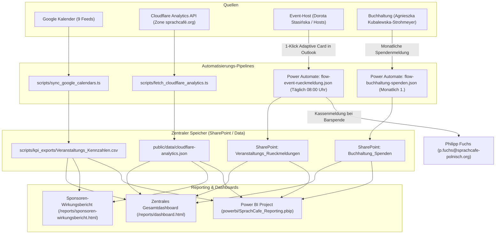

# Gesamtsystem: All-in-One Controlling-Dashboard & M365 Adaptive Cards Flows

- **Dokument-ID**: `/docs/UNIFIED_DASHBOARD_AND_FLOWS.md`
- **Status**: Implementiert & Produktiv
- **Datum**: 2026-08-19
- **Komponenten**:
  - `scripts/fetch_cloudflare_analytics.ts` (Cloudflare Web Analytics)
  - `scripts/flows/flow-event-rueckmeldung.json` (Tägliche M365 Outlook Adaptive Card)
  - `scripts/flows/flow-buchhaltung-spenden.json` (Monatliche Buchhaltungsmeldung)
  - `scripts/generate_powerbi_previews.ts` (Dashboard-Generator)
  - `frontend/public/reports/dashboard.html` (Zentrales Gesamtdashboard)
  - `frontend/public/reports/sponsoren-wirkungsbericht.html` (Sponsoren-Handout)
  - `powerbi/` (Power BI Project & Modell)

---

## 1. Architektur & Datenflüsse

Das Gesamtsystem vereint vier bisher getrennte Datenströme in einem einheitlichen Cockpit:

---

## 2. Die M365 Adaptive Cards Flows im Detail

### 1. Tägliche Event-Rückmeldung (`flow-event-rueckmeldung.json`)
- **Trigger**: Jeden Morgen um 08:00 Uhr.
- **Ablauf**:
  1. Ermittelt alle am Vortag beendeten Veranstaltungen.
  2. Sendet eine interaktive **Outlook Actionable Message / Adaptive Card** an **Dorota Stasińska** (`d.stasinska@sprachcafe-polnisch.org`).
  3. Dorota trägt direkt in der E-Mail ohne separaten Login ein:
     - `teilnehmerGesamt` (Pflichtfeld, z. B. `16`)
     - `davonKinder` (optional, z. B. `5`)
     - `spendenBar` (optional, z. B. `20.00 €`)
     - `notiz` (optional, z. B. *„Sehr gut besucht, viele neue Eltern aus Heinersdorf“*)
  4. Die Eingabe wird direkt in der SharePoint-Liste `Veranstaltungs_Rueckmeldungen` gespeichert.
  5. **Kassenbenachrichtigung**: Wenn `spendenBar > 0`, erhält **Philipp Fuchs** (`p.fuchs@sprachcafe-polnisch.org`) automatisch eine E-Mail mit der Kassennotiz für den täglichen Kassenabgleich.

### 2. Monatliche Buchhaltungs- & Spendenmeldung (`flow-buchhaltung-spenden.json`)
- **Trigger**: Am 1. jedes Monats um 09:00 Uhr.
- **Ablauf**:
  1. Sendet eine monatliche Adaptive Card an **Agnieszka Kubalewska-Strohmeyer** (`A.Strohmeyer@sprachcafe-polnisch.org`).
  2. Agnieszka erfasst die aggregierten Monatssummen (Allgemeine Spenden, Zweckgebundene Projektspenden, Mitgliedsbeiträge, Eigenanteile).
  3. Die Werte fließen in die SharePoint-Liste `Buchhaltung_Spenden` und stehen sofort im Dashboard für Verwendungsnachweise bereit.

---

## 3. Cloudflare Web Analytics Fetcher

- **Skript**: `scripts/fetch_cloudflare_analytics.ts`
- **Funktion**: Fragt die Zone `sprachcafé.org` (`cd0cbfef3ea0701dced3040b2589881c`) ab.
- **Exportiert**:
  - Gesamtzahl Seitenaufrufe (z. B. `14.820`) & Unique Visitors (`3.150`).
  - Länderverteilung: Deutschland (`56 %`), Polen (`38 %`), Sonstige (`6 %`).
  - Top-Seiten: `/veranstaltungen/`, `/news/`, `/hausbibliothek/`, `/ueber-uns/ausstellungen/`.
- **Datenschutz**: 100 % DSGVO-konform, Zero-Cookie, keine personenbezogene Speicherung.

---

## 4. Bereitgestellte Dashboards & URLs

| Dashboard / Report | URL / Pfad | Zweck & Zielgruppe |
| :--- | :--- | :--- |
| **Zentrales Gesamtdashboard (All-in-One)** | [https://sprachcafé.org/reports/dashboard.html](https://xn--sprachcaf-j4a.org/reports/dashboard.html) | Vollständige Vorstandsansicht: Events, Headcounts, Web Analytics & Finanzen |
| **Sponsoren-Wirkungsbericht (PDF/PPT)** | [https://sprachcafé.org/reports/sponsoren-wirkungsbericht.html](https://xn--sprachcaf-j4a.org/reports/sponsoren-wirkungsbericht.html) | Schlankes 16:9-Handout für externe Zuwendungsgeber und Förderanträge |
| **Internes Controlling & Detail-Matrix** | [https://sprachcafé.org/reports/internes-monitoring.html](https://xn--sprachcaf-j4a.org/reports/internes-monitoring.html) | Granulare Tabellenmatrix nach Monat, Ort, Zielgruppe und Projekt |
| **Power BI Projektdateien** | `powerbi/SprachCafe_Reporting.pbip` | Für Analysten in Power BI Desktop & Service |
