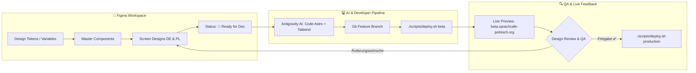

# 🎨 SprachCafé Polnisch – UX Design System & Designer Handoff Handbook

> **Zweck dieses Handbuchs:**  
> Dieses Dokument definiert das branchenübliche Kollaborations- und Design-System für SprachCafé Polnisch (`https://sprachcafé.org` / `https://xn--sprachcaf-j4a.org/`). Es ermöglicht unserer UX-Designerin, in **Figma** frei, kreativ und konsistent zu entwerfen, während Entwickler und die **Antigravity AI** die Entwürfe mit 100%iger Präzision in sauberen, barrierefreien **Astro + Tailwind CSS** Code übersetzen.

---

## 📑 Inhaltsverzeichnis
1. [Systemarchitektur & Workflow-Übersicht](#1-systemarchitektur--workflow-übersicht)
2. [Figma-Projektstruktur & Best Practices](#2-figma-projektstruktur--best-practices)
3. [Design Tokens & 1:1 Tailwind Mapping](#3-design-tokens--11-tailwind-mapping)
4. [Responsive Grid & Breakpoints](#4-responsive-grid--breakpoints)
5. [Bilinguale Anforderungen (DE / PL) & Accessibility (WCAG AA)](#5-bilinguale-anforderungen-de--pl--accessibility-wcag-aa)
6. [Bestehendes Komponenten-Inventar](#6-bestehendes-komponenten-inventar)
7. [Der 6-Schritte Handoff- & Review-Zyklus](#7-der-6-schritte-handoff--review-zyklus)
8. [Designer Quick-Start Checkliste](#8-designer-quick-start-checkliste)

---

## 1. Systemarchitektur & Workflow-Übersicht



### Tech-Stack im Hintergrund:
- **Frontend-Framework:** Astro 5 (Static Site Generation / Islands Architecture)
- **Styling:** Tailwind CSS 3.4 (Token-gesteuert)
- **Typografie:** `Literata` (Headings/Serif) & `Plus Jakarta Sans` (Body/UI Sans)
- **Staging-Umgebung:** `https://beta.sprachcafe-polnisch.org` (Caddy Reverse Proxy auf AWS EC2)
- **Produktion:** `https://sprachcafé.org` (`https://xn--sprachcaf-j4a.org/`)

---

## 2. Figma-Projektstruktur & Best Practices

Damit Entwickler und die KI Entwürfe ohne Missverständnisse auslesen können, ist das Figma-Projekt in folgende Seiten unterteilt:

```text
📁 SprachCafé Web Portal (Figma)
├── 🎨 01_Design Tokens & UI-Kit
│   ├── Colors (Primitives & Semantic)
│   ├── Typography Styles (Mobile & Desktop)
│   ├── Spacing & Elevation / Shadows
│   └── Base Atoms (Buttons, Inputs, Badges, Icons)
├── 🧩 02_Komponenten & Module
│   ├── Navigation (Header, MegaMenu, Mobile Drawer, Lang Switcher)
│   ├── Hero & Kiez-Hub Selector
│   ├── Event & Kurs Cards (Vintage Ticket Style)
│   ├── Formulare (Mitgliedschaft, Ehrenamt, Kontakt)
│   └── Footer
├── 📐 03_Layouts & Grids (Breakpoints)
├── 📱 04_Screens (Drafts / In Arbeit)
└── 🚀 05_Ready for AI / Dev (Freigegebene Frames für Sprints)
```

### Figma Best Practices für die Designerin:
1. **Auto-Layout nutzen:** Bitte alle Komponenten, Cards und Formulare mit Figma Auto-Layout aufbauen (Flexbox-äquivalent). Das sichert exaktes Padding und responsive Skalierung.
2. **Variable / Token Bindung:** Verwende in Figma keine losen Hex-Codes, sondern verknüpfe alle Farben und Abstände mit den definierten Figma-Variablen.
3. **Komponenten-Status abbilden:** Jedes interaktive Element (Buttons, Links, Inputs) sollte mindestens die Varianten `Default`, `Hover`, `Active`, `Focus` und `Disabled` enthalten.
4. **Zweisprachige Frames:** Für jede Hauptseite bitte sowohl die deutsche (`DE`) als auch die polnische (`PL`) Textvariante anlegen.

---

## 3. Design Tokens & 1:1 Tailwind Mapping

Die Tokens in Figma korrespondieren exakt mit [`tailwind.config.mjs`](file:///home/ubuntu/sprachcafe-relaunch/frontend/tailwind.config.mjs):

### 3.1 Farbpalette (Warm Café & Literature Community)

| Figma Token Name | Hex-Code | Tailwind Klasse | Verwendung / Semantik |
| :--- | :--- | :--- | :--- |
| `brand/primary` | `#8B1E2D` | `bg-primary`, `text-primary` | **Deep Polish Carmine** (Hauptmarkenfarbe, CTAs, Headers) |
| `brand/primary-hover`| `#6E1420` | `hover:bg-primary-hover` | Dunklerer Rot-Ton bei Hover/Active |
| `brand/primary-light`| `#FF758F` | `text-primary-dark` | Helles Karmin für Dark-Mode Akzente |
| `brand/secondary` | `#3B6B35` | `bg-tertiary`, `text-tertiary` | **Warm Olive / Sage Green** (Kultur, Natur, Nachhaltigkeit) |
| `brand/amber` | `#D97706` | `bg-accent-amber-honey` | **Amber Honey** (Highlights, Tags, Badges) |
| `surface/paper` | `#FDFBF7` | `bg-surface-paper` | **Paper White** (Karten-Hintergründe, Formularfelder) |
| `surface/container` | `#F2ECE4` | `bg-surface-container` | Sanfter Beige-Ton für Sektionshintergründe |
| `surface/dark` | `#181615` | `bg-surface-dark` | Tiefer warmer Anthrazitton für Dark Mode & Footer |
| `on-surface/text` | `#1D1B1A` | `text-brand-text` | Haupt-Textfarbe (hoher Kontrast, WCAG AAA) |
| `on-surface/muted`| `#5B403D` | `text-brand-text-muted` | Sekundärtext, Metadaten, Autorenzeilen |
| `border/default` | `#E2D8CC` | `border-brand-border` | Subtile Trennlinien, Card-Borders |

---

### 3.2 Typografie-System

| Figma Text Style | Font Family | Size / Line-Height | Weight | Tailwind Klasse |
| :--- | :--- | :--- | :--- | :--- |
| `Display / Hero` | `Literata` (Serif) | `48px / 1.15` (Mobile: `32px`) | Bold (700) | `font-serif text-3xl md:text-5xl` |
| `Heading / H1` | `Literata` (Serif) | `36px / 1.2` (Mobile: `28px`) | SemiBold (600) | `font-serif text-2xl md:text-4xl` |
| `Heading / H2` | `Literata` (Serif) | `28px / 1.25` (Mobile: `24px`)| SemiBold (600) | `font-serif text-xl md:text-3xl` |
| `Heading / H3` | `Plus Jakarta Sans` | `20px / 1.3` | SemiBold (600) | `font-sans text-lg md:text-xl font-semibold` |
| `Body / Large` | `Plus Jakarta Sans` | `18px / 1.6` | Regular (400) | `font-sans text-lg leading-relaxed` |
| `Body / Default`| `Plus Jakarta Sans` | `16px / 1.6` | Regular (400) | `font-sans text-base leading-relaxed` |
| `Body / Small` | `Plus Jakarta Sans` | `14px / 1.5` | Regular / Med | `font-sans text-sm` |
| `UI / Button` | `Plus Jakarta Sans` | `15px / 1.0` | SemiBold (600) | `font-sans text-sm font-semibold tracking-wide` |

---

### 3.3 Abstände & Radius

- **Base Spacing Grid:** 4px Multiplikatoren (`4px`, `8px`, `12px`, `16px`, `24px`, `32px`, `48px`, `64px`)
- **Border Radius:**
  - `sm`: 4px (`rounded-sm` für Badges / Tags)
  - `md`: 8px (`rounded-md` für Buttons & Input-Felder)
  - `lg`: 12px (`rounded-lg` für Modale & Cards)
  - `xl`: 16px (`rounded-xl` für Container & Hero-Boxen)
  - `pill`: 9999px (`rounded-full` für Badges & Kiez-Hub Toggles)

---

## 4. Responsive Grid & Breakpoints

In Figma werden Screens für drei Haupt-Viewports gestaltet:

```text
┌─────────────────────────┬─────────────────────────┬─────────────────────────┐
│     📱 Mobile           │     💻 Tablet           │     🖥️ Desktop (Main)    │
│     Viewport: 375px     │     Viewport: 768px     │     Viewport: 1280px /  │
│     Columns: 4          │     Columns: 8          │               1440px    │
│     Margin: 16px        │     Margin: 32px        │     Columns: 12         │
│     Gutter: 12px        │     Gutter: 24px        │     Max-Width: 1280px   │
│                         │                         │     Gutter: 24px/32px   │
└─────────────────────────┴─────────────────────────┴─────────────────────────┘
```

---

## 5. Bilinguale Anforderungen (DE / PL) & Accessibility (WCAG AA)

### 5.1 Sprachbesonderheiten (Deutsch & Polnisch)
1. **Polnische Textausdehnung:** Polnische Übersetzungen sind im Schnitt 15% bis 30% länger als deutsche Texte. Buttons und Header-Navigationen müssen daher mit flexiblem Padding (`min-width` statt fester Pixelbreite) gestaltet werden.
2. **Sonderzeichen & Glyphen:** Die Schriften `Literata` und `Plus Jakarta Sans` unterstützen alle polnischen Diakritika (`ą, ć, ę, ł, ń, ó, ś, ź, ż`). Bitte bei neuen Icons oder SVG-Texten auf vollständigen Unicode-Support achten.

### 5.2 Barrierefreiheit (WCAG 2.1 AA)
- **Kontrast:** Mindestkontrast von **4.5:1** für Fließtext und **3.0:1** für Überschriften und UI-Icons (unsere Palette `#8B1E2D` auf `#FAF6EE` erreicht `6.2:1` ✅).
- **Touch-Targets:** Mobile Buttons und Links müssen mindestens **44 × 44 px** anklickbare Fläche bieten.
- **Formular-Labels:** Jedes Eingabefeld muss ein sichtbares Label und einen eindeutigen Fehlermeldungszustand (`state: error`) haben.

---

## 6. Bestehendes Komponenten-Inventar

Folgende Kernkomponenten existieren bereits im Code und können in Figma als Referenz genommen oder neu interpretiert werden:

1. **[`MegaMenuNav.astro`](file:///home/ubuntu/sprachcafe-relaunch/frontend/src/components/MegaMenuNav.astro):** Header mit Dropdowns für Kurse, Kultur, Hausbibliothek, Über uns und [`LanguageSwitcher.astro`](file:///home/ubuntu/sprachcafe-relaunch/frontend/src/components/LanguageSwitcher.astro).
2. **[`HeroSection.astro`](file:///home/ubuntu/sprachcafe-relaunch/frontend/src/components/HeroSection.astro):** Willkommensbereich mit Call-to-Actions (Mitmachen, Spenden, Raum mieten).
3. **[`KiezHubSelector.astro`](file:///home/ubuntu/sprachcafe-relaunch/frontend/src/components/KiezHubSelector.astro):** Interaktiver Umschalter zwischen den Standorten **Pankow** (Schulzestr. 1) und **Köpenick**.
4. **[`VintageEventTicketCard.astro`](file:///home/ubuntu/sprachcafe-relaunch/frontend/src/components/VintageEventTicketCard.astro):** Eventkarten im Vintage-Papierticket-Stil mit Abreißkante, Datum, Uhrzeit und Ticket-CTA.
5. **[`BookshelfWidget.astro`](file:///home/ubuntu/sprachcafe-relaunch/frontend/src/components/BookshelfWidget.astro):** Vorschau der neuesten Bücher aus der [Hausbibliothek](file:///home/ubuntu/PROJECT.md).
6. **Formulare:**
   - [`MembershipForm.astro`](file:///home/ubuntu/sprachcafe-relaunch/frontend/src/components/MembershipForm.astro) (Mitgliedsantrag)
   - [`ContactForm.astro`](file:///home/ubuntu/sprachcafe-relaunch/frontend/src/components/ContactForm.astro) (Kontakt & Feedback)
   - [`ChildrenEventForm.astro`](file:///home/ubuntu/sprachcafe-relaunch/frontend/src/components/ChildrenEventForm.astro) (Anmeldung Kinderveranstaltungen)

---

## 7. Der 6-Schritte Handoff- & Review-Zyklus

```text
Schritt 1: Sprint & Modul festlegen (z.B. Sprint 2: Startseite & Hero)
   │
Schritt 2: Designerin entwirft in Figma (Draft -> Mobile & Desktop Screens)
   │
Schritt 3: Designerin setzt Status-Badge auf "🚀 Ready for Dev" & teilt Frame-Link
   │
Schritt 4: Antigravity AI codiert Astro-Komponenten & Tailwind-Klassen auf Git-Branch
   │
Schritt 5: Automatisches Deployment auf Staging: ./scripts/deploy.sh beta
   │       -> Live prüfen unter: https://beta.sprachcafe-polnisch.org
   │
Schritt 6: Designer-Review & Feedback. Nach Freigabe -> Merge & Production Livegang!
```

---

## 8. Designer Quick-Start Checkliste

Wenn du einen neuen Entwurf in Figma fertigstellst, prüfe kurz diese Checkliste:

- [ ] **Desktop & Mobile:** Liegt der Entwurf in Desktop (1280px+) und Mobile (375px) vor?
- [ ] **Bilingual:** Wurden sowohl die deutsche (`DE`) als auch die polnische (`PL`) Version geprüft (Textlängen)?
- [ ] **Tokens verwendet:** Sind Farben und Schriften aus dem UI-Kit verknüpft (keine unbenannten Hex-Werte)?
- [ ] **Interaktive Zustände:** Sind Hover- und Focus-Zustände für Buttons und Links definiert?
- [ ] **Asset-Export:** Sind neue Vektorgrafiken als saubere SVG und Fotos als optimierte WebP/JPG exportierbar?
- [ ] **Status:** Wurde der Frame auf die Seite `🚀 05_Ready for AI / Dev` verschoben oder mit `Ready for Dev` markiert?

---

> 💡 **Tipp für das Team:**  
> Sobald ein Figma-Link im Chat geteilt wird, kann die KI sofort den entsprechenden Astro-Code generieren, validieren und per `./scripts/deploy.sh beta` auf die Staging-URL bringen!
