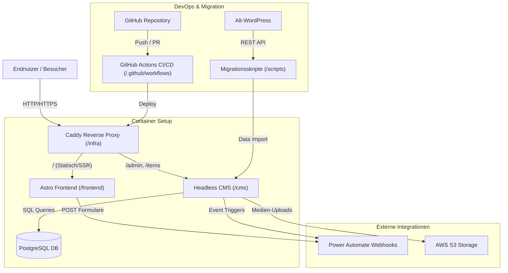

# Architektur-Übersicht - SprachCafé Relaunch

Dieses Dokument beschreibt die Gesamtarchitektur, Datenflüsse und Systemkomponenten des SprachCafé Monorepos.

## Systemarchitektur (Mermaid Diagramm)

## Schnittstellen & Datenflüsse

1. **Endnutzer -> Frontend**: Der Caddy Reverse Proxy leitet Anfragen an das Astro Frontend weiter.
2. **CMS -> AWS S3**: Hochgeladene Bilder und Medien der News/Veranstaltungen werden auf S3 gehostet.
3. **Frontend/CMS -> Power Automate**: Formular-Submissions (z.B. Mitgliedsanträge, Hausbibliothek-Ausleihe) werden direkt per Webhook an Power Automate übermittelt.
4. **Migration -> CMS**: Das `/scripts` Paket liest historische WordPress-Daten aus und transformiert sie in die PostgreSQL-Datenbank des CMS.
