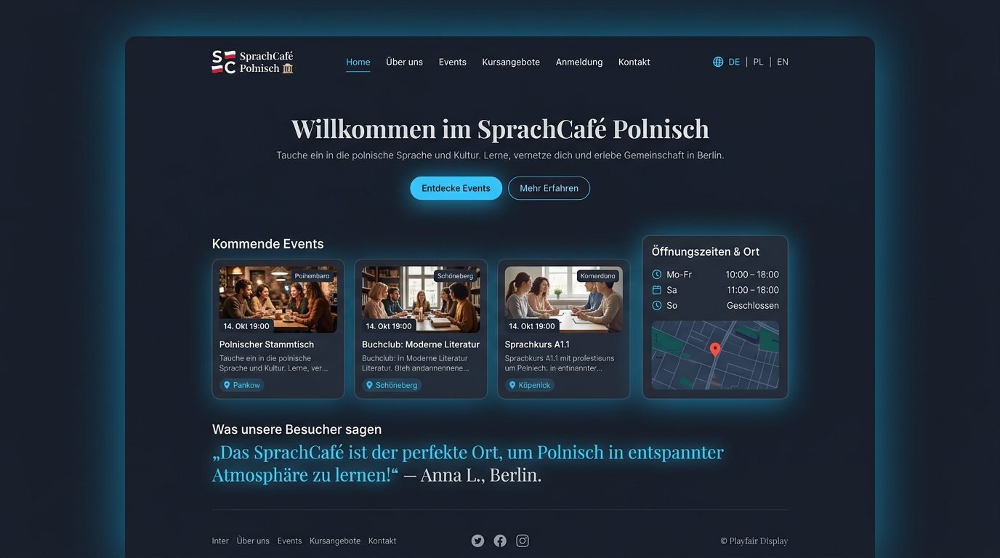
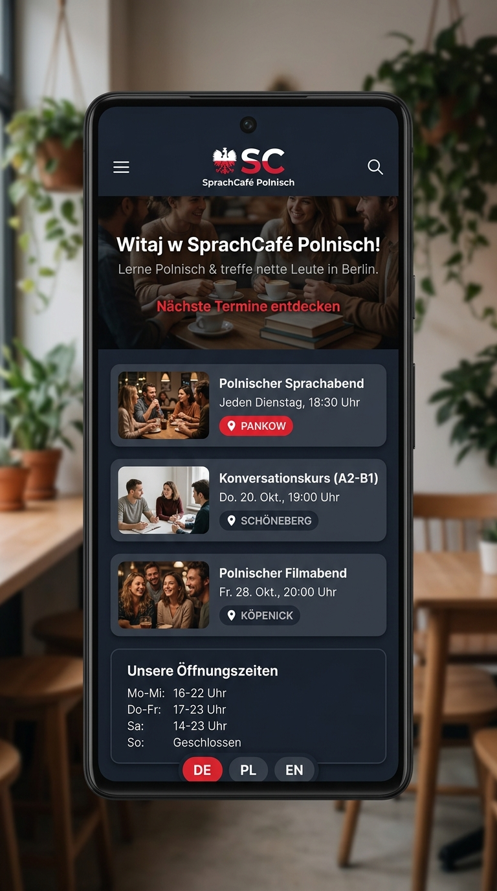

# Visuelles Inventar & Design Audit (https://sprachcafe-polnisch.org/)

Dieses Dokument dient als zentrale Referenz für das visuelle Inventar, die wiederkehrenden UI-Muster und das Layout-Design des SprachCafé Relaunchs.

---

## 📸 1. Visuelles Inventar der Seitentypen

### A. Startseite (Homepage)

Die Startseite kombiniert ein einladendes Hero-Banner, eine Vorschau der nächsten Veranstaltungen nach Standorten, eine Zitat-Sektion für Teilnehmerstimmen sowie das Öffnungszeiten-Widget.

#### Desktop-Ansicht (Desktop View)

- **Merkmale**: Max-width 1200px Layout, dunkles Theme (`#0f172a`), klare Typografie-Hierarchie, Sticky Navigation mit Sprach-Umschalter (DE/PL/EN).

#### Mobile-Ansicht (Mobile View)

- **Merkmale**: Einspaltiger Content-Fluss, ausklappbare Hamburger-Navigation, vertikal gestapelte Event-Karten und komprimierte Öffnungszeiten-Box.

---

### B. Übersicht der Seitentypen (Page Types Inventory)

| Seitentyp | Hauptkomponenten | Besonderheiten & Interaktions-Elemente |
|-----------|------------------|----------------------------------------|
| **Startseite** | Hero Banner, Event Preview Grid, Zitat-Sektion, Öffnungszeiten Widget | Quick-Links zu Kursen, Sprachumschalter, Call to Action |
| **Event-Liste** | Filterleiste (Standort, Sprache, Zielgruppe), 3-Spalten Event-Grid | Standort-Pill-Badges (Pankow, Schöneberg, Köpenick), Datum & Uhrzeit |
| **Event-Detail** | Header-Bild, Metadaten-Box (Uhrzeit, Raum, Sprache), Buchungs/Anmelde-CTA | Zurück-Navigation, Link zum Kontaktformular / Power Automate Webhook |
| **Blogbeitrag** | Artikel-Header, Autorenzeile, Rich-Text Fließtext, verwandte Beiträge | Lesefreundliche Typografie (4.5:1 Kontrast), Veröffentlichungsdatum |
| **Team & Partner** | Vorstands- & Team-Grid, Partner-Logos, Rollenbeschreibung | Kontakt-Möglichkeiten, Aufgabenbereiche |
| **Kontakt & Anfahrt** | Kontaktformular, Anfahrtsbeschreibungen je Standort, Öffnungszeiten | Power Automate Webhook Anbindung, Anfahrtsskizzen |
| **Header & Navigation** | Markenlogo, Hauptnavigation, Sprach-Pills (DE/PL/EN), Skip-Link | Sticky Positionierung, Tastatur-Fokusringe (WCAG 2.1 AA) |
| **Footer** | Vereinsangaben, Copyright, Social Media Links, Impressum, Datenschutz | Semantisches `<footer>` Landmark, Barrierefreiheits-Erklärung |

---

## 🎨 2. Wiederkehrende UI-Muster (Design Patterns)

### 1. Hero-Bereich (Hero Section)
- **Aufbau**: Zentrierter oder linksbündiger Titel, prägnanter Untertitel, Badge-Pill ("Offizielle Plattform") und doppelte CTA-Buttons (Primär: Sky-Blue, Sekundär: Ghost/Outline).
- **Zweck**: Sofortige Vermittlung der Vereinsidentität (Sprachaustausch, Begegnung, deutsch-polnische Kultur).

### 2. Karten-Grids (Card Grids)
- **Aufbau**: Responsive 1-, 2- oder 3-Spalten-Raster für Veranstaltungen, News und Hausbibliothek-Bücher.
- **Elemente**: Vorschaubild mit Hover-Zoom, Standort-Badge (`Pankow`, `Schöneberg`, `Köpenick`), Datumsanzeige, Titel, Kurzbeschreibung und Detail-Link.

### 3. Zitat-Sektion (Testimonial / Voice Section)
- **Aufbau**: Großformatige Zitat-Box mit subtilen Anführungszeichen, hervorgehobener Schriftart und Zitatgeber-Zuordnung.
- **Zweck**: Stärkung des Vertrauens und Repräsentation der Community-Stimmen.

### 4. Öffnungszeiten-Boxen (Opening Hours Widget)
- **Aufbau**: Strukturiertes Slate-Card-Widget mit Uhrzeiten für Werktage, Wochenenden und Schließtage.
- **Erweiterung**: Standortbezogene Tabs oder Karten-Ausschnitte.

### 5. CTA-Buttons (Call to Action)
- **Primär-Button**: `bg-sky-400` / `bg-sky-500` mit dunkler Schrift (`text-slate-950`), abgerundeten Ecken (`rounded-xl`), Schatten-Effekt und fokussierbarem Accessibility-Ring (`focus:ring-2 focus:ring-sky-400`).
- **Sekundär-Button**: Transparenter Hintergrund mit Slate-Border (`border border-slate-700`) und Hover-Aufhellung.

### 6. Navigation & Sprach-Umschalter
- **Header Navigation**: Horizontale Links mit hoher Kontrastwirkung (`text-slate-300` zu `text-sky-400`).
- **Language Switcher**: Abgerundete Pill-Container (`DE`, `PL`, `EN`) mit Flaggen-Icon und aktiver Hervorhebung (`bg-sky-400 text-slate-950`).
