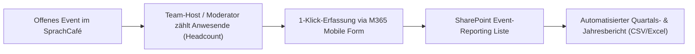

# Anforderungsanalyse: Kennzahlen & Reporting für Projektabrechnungen (KPI-Konzept)

- **Dokument-ID**: `/docs/kpi-anforderungen.md`
- **Status**: Freigegeben / Arbeitsgrundlage
- **Datum**: 2026-08-19
- **Zielgruppe**: Vereinsvorstand, Projektleitung, Redaktionsteam, Web-Entwicklung (Grundlage für Aufgabe S.2 ff.)

---

## 1. Management Summary & Zielsetzung

Als gemeinnütziger Träger im Bereich interkultureller Begegnung, Mehrsprachigkeit und Bildung finanziert der **SprachCafé Polnisch e.V.** seine Aktivitäten maßgeblich über öffentlich-rechtliche Zuwendungen (Bezirk, Land Berlin, Bund) sowie deutsch-polnische und überregionale Stiftungen.

Für **Verwendungsnachweise (VN)**, **Sachberichte** und **Jahresberichte** fordern Zuwendungsgeber präzise quantitative und qualitative Leistungsdaten. Ziel dieser Anforderungsanalyse ist es:
1. Zu klären, **welche Kennzahlen tatsächlich für Abrechnungen gebraucht werden** (keine unnötige Datenanhäufung).
2. Ein praxistaugliches, ehrenamtsfreundliches Erfassungskonzept für **Teilnehmerzahlen bei offenen Veranstaltungen ohne Voranmeldung** zu definieren.
3. Die technischen Datenquellen im neuen Webportal (Astro SSG, Google Calendar, Mailchimp, M365/SharePoint, Hausbibliothek) datenschutzkonform (DSGVO-by-Design) an die Reporting-Bedarfe anzubinden.
4. Die Notwendigkeit und Umsetzung einer **Förderprojekt-Taxonomie (Projekt-Tagging)** für Folgeaufgaben zu bewerten.

---

## 2. Zuwendungsgeber & Nachweispflichten

Die Nachweisanforderungen richten sich nach den **Allgemeinen Nebenbestimmungen für Zuwendungen zur Projektförderung (ANBest-P / BNBest-P)** sowie den spezifischen Leitfäden der Mittelgeber des SprachCafé Polnisch e.V.:

| Zuwendungsgeber / Programm | Typische Förderbereiche | Wesentliche Nachweispflichten im Sachbericht |
| :--- | :--- | :--- |
| **Bezirksamt Pankow von Berlin** (Integrationsfonds, FEIN, Kulturamt) | Stadtteilkultur, Sprachförderung, Begegnungsangebote in Pankow | • Anzahl durchgeführter Veranstaltungen im Bezirk<br>• Teilnehmendenzahlen (geschätzt/gezählt)<br>• Standorte / genutzte Räume (z. B. Bibliothek, Stadtteilzentrum)<br>• Zielgruppenansprache (Familien, Neuzugewanderte, SeniorInnen) |
| **Senatsverwaltung für Kultur und Gesellschaftlichen Zusammenhalt** (Berlin) | Partizipation, Erinnerungskultur, Mehrsprachigkeit | • Projektlaufzeiten & Meilensteine<br>• Teilnehmendenstruktur & Diversität<br>• Kooperationspartner & Öffentlichkeitswirkung |
| **Bundesebene / Stiftungen** (BKM, DSEE, Fonds Soziokultur, Demokratie leben!) | Modellprojekte, Ehrenamtsstärkung, Demokratiebildung | • Detaillierte Maßnahmeübersichten<br>• Wirkungsindikatoren & Teilnehmendenzahlen<br>• Medien- & Reichweitenberichte (Website, Social Media, Newsletter) |
| **Deutsch-Polnische Förderer** (SdpZ / FWPN, Wspólnota Polska, KPRM/Senat RP) | Zweisprachige Bildung, polnische Kultur & Tandems | • Zweisprachige Dokumentation der Maßnahmen<br>• Zahl der erreichten polnisch- und deutschsprachigen Personen<br>• Veröffentlichungen & publizierte Materialien |
| **Finanzamt für Körperschaften** (Gemeinnützigkeit) | Steuerbegünstigte satzungsmäßige Zwecke | • Nachweis der tatsächlichen Geschäftsführung<br>• Mitgliederentwicklung & Einnahmen/Spenden |

---

## 3. Kern-Kennzahlen im Detail

### 3.1. Teilnehmerzahlen (Teilnehmende & Besucher)

#### Problemstellung
Fast alle regulären Angebote des SprachCafés (z. B. wöchentliches Sprachcafé, Speak-Dating, Leniwa Niedziela, Ausstellungen, offene Lesungen) sind **niedrigschwellige, offene Begegnungsangebote ohne Anmeldepflicht**. Eine Registrierungspflicht würde Hemmschwellen aufbauen und widerspricht dem integrativen Vereinszweck.

#### Erfassungskonzept für offene Events (Zero-Friction):
Für die Praxis von Verwendungsnachweisen ist rechtlich **keine namentliche Teilnehmerliste bei offenen Veranstaltungen** vorgeschrieben. Gefordert ist eine **plausible und nachvollziehbare Dokumentation (Headcount / Schätzung)**.



1. **Host-Quick-Report (Mobiles Kurzformular)**:
   - Nach Ende einer Veranstaltung trägt der/die jeweilige Host/Moderator/in über ein einfaches Smartphone-Formular (M365 Forms / Power Automate) drei Pflichtfelder ein:
     - **Event / Format** (Dropdown oder Kalender-Referenz)
     - **Datum**
     - **Geschätzte/Gezählte Personenzahl** (z. B. `18`)
     - *Optional:* Davon Kinder / Jugendliche (z. B. `6`)
   - Zeitaufwand: **unter 30 Sekunden**.
2. **Sammelerfassung für Regelformate**:
   - Für wöchentliche Stammformate (z. B. Sprachcafé Mittwochs) kann alternativ am Monatsende eine aggregierte Monatsmeldung durch die Gruppenleitung erfolgen (z. B. „4 Termine im März, durchschnittlich 12 Personen = 48 Teilnahmen“).
3. **Spezial-Workshops mit Anmeldepflicht**:
   - Nur bei platzbeschränkten Sonderveranstaltungen (z. B. Kinder-Theaterworkshops, Kochkurs) erfolgt die Voranmeldung digital über die Website (`events`-Detailseite $\rightarrow$ M365 Formular), wodurch die genaue Teilnehmendenliste automatisch vorliegt.

---

### 3.2. Mitgliederzahlen & -entwicklung

- **Zweck**: Verwendungsnachweise, Nachweis der zivilgesellschaftlichen Verankerung, Mitgliederversammlung & Amtsgericht/Vereinsregister.
- **Benötigte Metriken**:
  - Gesamtanzahl Mitglieder (Stichtage 01.01. und 31.12.)
  - Netto-Wachstum (Neuzugänge vs. Austritte im Förderjahr)
  - Differenzierung: Ordentliche Mitglieder vs. Fördermitglieder
- **Datenquelle im System**:
  - Das digitale Mitgliedsantragsformular (`frontend/src/components/ApplicationForm.astro`) übergibt Neuanträge per Power Automate direkt an die interne SharePoint-Liste `Mitgliederverwaltung`.
  - Der Mitgliederstand kann tagesaktuell oder stichtagsbezogen gefiltert und als Excel/CSV exportiert werden.

---

### 3.3. Spendenvolumen & Eigenmittel

- **Zweck**:
  - Nachweis des geforderten **Eigenmittelanteils** bei Förderprojekten (oft 10–20 % der Gesamtausgaben).
  - Nachweis über **zweckgebundene Spenden** (z. B. für Bücheranschaffungen, Renovierung, bestimmte Workshops).
- **Benötigte Metriken**:
  - Gesamtspendenvolumen pro Kalenderjahr
  - Anzahl der Einzelspender/innen (aggregiert)
  - Anteil projektbezogener Spenden vs. allgemeiner Vereinsspenden
- **Datenquelle**:
  - Vereinskonto & PayPal-Schnittstelle (aggregierte Finanzbuchhaltung im Verein).
  - Online-Spendenaufrufe verweisen auf dedizierte Verwendungszwecke/Projekt-IDs.

---

### 3.4. Veranstaltungszahlen nach Dimensionen (Standort, Sprache, Zielgruppe)

Fördergeber fordern differenzierte Übersichten, um festzustellen, ob Fördermittel zielgruppengerecht und im vereinbarten Einzugsgebiet eingesetzt wurden.

#### Dimensions-Matrix:

| Dimension | Erfasste Kategorien / Ausprägungen | Relevanz für Förderer |
| :--- | :--- | :--- |
| **Standort / Ort** | • Schulzestraße 1 (Hauptstandort)<br>• Stadtteilzentrum Pankow<br>• Janusz-Korczak-Bibliothek<br>• Alte Apotheke Heinersdorf<br>• Online / Zoom / Digital<br>• Sonstige Kooperationsorte | Bezirksbezogene Nachweise (z. B. Pankow FEIN / Integrationsfonds) |
| **Sprache** | • Polnisch (`pl`)<br>• Deutsch (`de`)<br>• Zweisprachig (`pl/de`)<br>• Sonstige / Englisch (`en`) | SdpZ, Wspólnota Polska, DÜF, Land Berlin (Mehrsprachigkeit) |
| **Zielgruppe** | • Kinder & Familien (`kinder`)<br>• Sprachpraxis & Tandem (`sprache`)<br>• Kunst, Ausstellungen & Literatur (`kultur`)<br>• Ehrenamt & Vereinsleben (`team`) | Zielgruppenspezifische Förderprogramme (z. B. DSEE für Ehrenamt, Jugendförderung) |

#### Datenquelle im System:
Die Astro Content Collection `events` wird über den Google Calendar Sync (`gcal-sync`) automatisch mit `location`, `language` und Kategorien (`category`) befüllt. Über ein einfaches Node-Skript oder eine Abrechnungsansicht können Event-Zahlen pro Dimension auf Knopfdruck aggregiert werden.

---

### 3.5. Website-Reichweite & Digitale Öffentlichkeitsarbeit

- **Zweck**: Nachweis der Öffentlichkeitswirkung und Sichtbarkeit geförderter Maßnahmen (z. B. BKM, DSEE, SdpZ).
- **DSGVO-by-Design Prinzip**:
  - Keine Drittanbieter-Tracker (Google Analytics, Meta-Pixel, Hotjar sind im Projekt strikt ausgeschlossen).
  - Keine Cookie-Banner-Belästigung für Besucher.
- **Zulässige & aussagekräftige Datenquellen**:
  1. **Server-Log-Statistiken (Caddy / GoAccess)**:
     - Aggregierte Seitenaufrufe, eindeutige Besucher (IP anonymisiert), Top-Seiten (z. B. Aufrufe einer bestimmten Ausstellung oder Projektseite).
  2. **Cloudflare Privacy-First Web Analytics**:
     - 100 % cookie- und DSGVO-konform, liefert aggregierte Seitenaufrufe und Länderverteilung (Deutschland, Polen etc.).
  3. **Mailchimp Newsletter Metriken**:
     - Abonnentenzahl (z. B. ~1.500 Empfänger), Öffnungsraten, Veröffentlichungsfrequenz von Projektberichten in `/news/`.
  4. **Hausbibliothek Online-Nutzung**:
     - Katalogaufrufe, aktive Ausleihen, Neuanmeldungen aus der Web-App.

---

## 4. Förderprojekt-Zuordnung (Projekt-Taxonomie)

### 4.1. Ist-Zustand
Aktuell existiert im System **kein einheitliches Tagging für einzelne Förderprojekte**:
- Google Calendar Termine enthalten nur Datum, Titel, Ort und Beschreibung.
- News-Artikel enthalten Titel, Datum, Sprache und Text.
- Förderer-Logos sind statisch in `partners.json` hinterlegt und werden im Footer/Partnerbereich pauschal angezeigt.

### 4.2. Soll-Konzept für Förderprojekte
Um bei einer Projektabrechnung (z. B. *„Projekt X gefördert durch SdpZ im Zeitraum 01.03.–31.10.2026“*) alle zugehörigen Maßnahmen, Artikel und Teilnehmenden auf Knopfdruck auszuweisen, ist eine **optionale Projekt-Taxonomie** sinnvoll:

```yaml
# Beispiel: Optionale Projekt-Metadaten in Events oder News Frontmatter
project: "sdpz-2026-literatur"   # Optionaler Projekt-Identifier
funder: "SdpZ"                   # Förderer-Kürzel
```

#### Praxistaugliche Erfassung für die Redaktion:
- **Im Google Calendar**: Redakteurinnen können in der Event-Beschreibung oder im Titel optional einen Hashtag setzen (z. B. `#projekt-sdpz26` oder `[Projekt: SdpZ]`).
- **Im gcal-sync**: Das Skript parst den Hashtag/Identifier und mappt ihn automatisch in das Frontmatter-Feld `project: "..."`.
- **Im News-Webhook (Mailchimp)**: Falls im Mailchimp-Newsletter ein Kampagnen-Tag oder Hashtag hinterlegt ist, wird dieser als `project` übernommen.

---

## 5. Handlungsempfehlungen & Aufgaben-Roadmap

Auf Basis dieser Analyse ergeben sich folgende konkrete Teilaufgaben für das Reporting-Modul:

| Phase / Aufgabe | Titel | Beschreibung & Umfang |
| :--- | :--- | :--- |
| **S.1 (dieses Dokument)** | **KPI-Anforderungsanalyse** | Ermittlung der tatsächlichen Bedarfe & Erfassungsmethoden. |
| **S.2** | **Reporting-Datenmodell & Taxonomie** | Definition des optionalen `project`-Schemas in `content/config.ts` (`events` & `news`) sowie Hashtag-Parsing im `gcal-sync`. |
| **S.3** | **Host-Quick-Report (M365/Forms)** | Erstellung eines minimalen Smartphone-Erfassungsformulars für Hosts (Teilnehmerzahl-Headcount) mit Ablage in SharePoint. |
| **S.4** | **Aggregations- & Export-Script** | CLI-Skript (`scripts/generate-kpi-report.ts`), das Events, News, Mitglieder und Teilnehmendenzahlen nach Zeitraum und Förderer/Projekt als saubere CSV/Markdown-Tabelle für den Verwendungsnachweis exportiert. |

---

## 6. Fazit

Für eine lückenlose und auditsichere Projektabrechnung sind keine komplexen, fehleranfälligen Tracking-Tools erforderlich. Mit der Kombination aus:
- **Kalender-Klassifizierung** (Ort, Sprache, Zielgruppe, optional Projekt-Hashtag),
- **30-Sekunden-Host-Headcount** bei offenen Events,
- **SharePoint-Mitgliederverwaltung** und
- **DSGVO-konformen Server-Log-Statistiken**
ist der SprachCafé Polnisch e.V. für alle gängigen Fördermittelgeber (Bezirk, Senat, Bund, Stiftungen) optimal, transparent und mit minimalem administrativem Aufwand aufgestellt.
