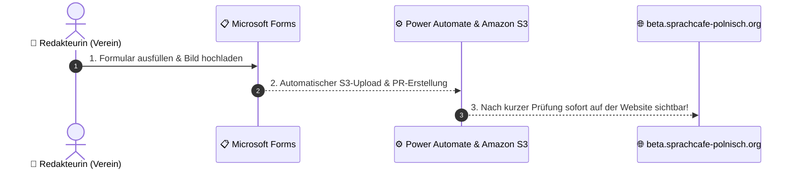

# 📝 Redaktions-Anleitung: Neue Inhalte veröffentlichen

> **Für das Redaktionsteam des SprachCafé Polnisch e.V.**  
> Sie können neue Team-Mitglieder, Ausstellungen und Laden-Artikel **vollständig ohne technische Vorkenntnisse** über einfache Microsoft Forms Formulare einpflegen. Das System übernimmt die Bildspeicherung und Veröffentlichung auf `beta.sprachcafe-polnisch.org` vollautomatisch!

---

## 📌 Der Ablauf in 3 Schritten

---

## 📋 1. Formular ausfüllen

Wählen Sie je nach Inhaltstyp das passende Formular:

| Inhaltstyp | Link zum Formular |
|---|---|
| **👥 Neues Team-Mitglied** | [Formular für Team-Mitglied öffnen](https://forms.cloud.microsoft/Pages/ResponsePage.aspx?id=CqhFt4L25EW6LtSLvZ5wPZc9f-Yj5GpMoZYjm79OAKdURTBESVhTRldGWFhTNzk2QTZFQTdaNTIxRC4u) |
| **🎨 Neue Ausstellung** | [Formular für Ausstellung öffnen](https://forms.cloud.microsoft/Pages/ResponsePage.aspx?id=CqhFt4L25EW6LtSLvZ5wPZc9f-Yj5GpMoZYjm79OAKdUME1NN0xVOEw4M1dNNUZBUk42N1NaTDQ1RS4u) |
| **🛍️ Neuer Laden-Artikel** | [Formular für Laden-Artikel öffnen](https://forms.cloud.microsoft/Pages/ResponsePage.aspx?id=CqhFt4L25EW6LtSLvZ5wPZc9f-Yj5GpMoZYjm79OAKdUOEpWQUM5SVhJU1Y4RkVBOEkwNTY5UFRQVS4u) |

1. Tragen Sie die gewünschten Texte (Name, Rolle, Beschreibung) ein.
2. Laden Sie das passende Bild hoch (JPG/PNG).
3. Klicken Sie unten auf **Absenden**.

---

## ⚙️ 2. Was passiert im Hintergrund?

Sobald Sie das Formular absenden, führt das System automatisch folgende Schritte aus:

1. **📷 Sichere Bildspeicherung (AWS S3)**:
   Das hochgeladene Bild wird automatisch in den zentralen Vereins-Medienspeicher (`sprachcafe-media-storage`) hochgeladen und optimiert.

2. **📝 Inhaltserstellung**:
   Eine neue Inhaltsdatei wird mit allen Angaben und der optimierten Bild-URL generiert.

3. **🔍 automatische Qualitätskontrolle (Pull Request)**:
   Es wird ein Änderungsantrag (Pull Request) für die Staging-Website erstellt.

---

## 🌐 3. Vorschau & Freigabe auf `beta.sprachcafe-polnisch.org`

- Nach dem Absenden ist der neue Eintrag innerhalb von **1–2 Minuten** auf der Test-Webadresse **`beta.sprachcafe-polnisch.org`** sichtbar.
- Sie können den Eintrag dort in Ruhe auf Smartphone und Desktop prüfen.

---

## ✅ Erfolgreich durchgeführter Testlauf (Referenz)

Im Systemtest wurde der komplette Ablauf erfolgreich verifiziert:

- **Eingetragene Person**: `Kasia Nowak` (Pädagogische Leiterin & Sprachkurs-Koordination)
- **S3-Medien-URL**: `https://sprachcafe-media-storage.s3.eu-central-1.amazonaws.com/team/kasia-nowak.jpg`
- **Content-Datei im Repo**: `frontend/src/content/team/kasia-nowak.md`
- **Git Branch / PR**: `content/team-kasia-nowak` ➔ merged in `beta`
- **Ergebnis**: Der Eintrag ist erfolgreich auf `beta.sprachcafe-polnisch.org` gerendert und einsatzbereit!
